<h1 align="center">LAPORAN ALGORITMA DAN STRUKTUR DATA
PERTEMUAN 1 - KONSEP DASAR PEMROGRAMAN

 

</h1>

<h2>Nama &nbsp;&nbsp;&nbsp;&nbsp;&nbsp;&nbsp;&nbsp;:&nbsp;Afifah Khoirunnisa
 
Kelas &nbsp;&nbsp;&nbsp;&nbsp;&nbsp;&nbsp;&nbsp;&nbsp;:&nbsp;TI-1B
 
NIM&nbsp;&nbsp;&nbsp;&nbsp;&nbsp;&nbsp;&nbsp;&nbsp;&nbsp;&nbsp;:&nbsp;2341720250
 
No.Abs&nbsp;&nbsp;&nbsp;&nbsp;&nbsp;:&nbsp;03</h2>

## 2.1 Pemilihan
## 2.2.1 Praktikum Pemilihan
## Pertanyaan
### 1. &nbsp;&nbsp;Buatlah program untuk menghitung nilai akhir dari mahasiswa dengan ketentuan 20% nilai tugas, 20% dari nilai kuis, 30% nilai UTS, dan 40% nilai UAS. Setiap nilai yang dimasukkan mempunyai batas nilai 0 ‐ 100. Ketika pengguna memasukkan diluar rentang tersebut maka akan keluar output “nilai tidak valid”. Ketika nilai akhir sudah didapatkan selanjutnya lakukan konversi nilai dengan ketentuan sebagai berikut:
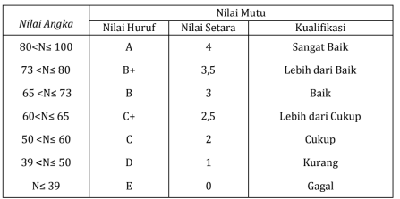

### &nbsp;&nbsp;Jika Nilai Huruf yang didapatkan adalah A,B+,B+C+,C maka LULUS, jika nilai huruf D dan E maka TIDAK LULUS.
### • Input dari program berupa komponen nilai tugas,kuis, UTS, UAS
### • Otuput dari program “nilai tidak valid” jika nilai yang dimasukkan diluar ketentuan
### • Output dari program berupa hasil nilai akhir, nilai huruf, dan keterangan LULUS/TIDAK LULUS

### Kode Program
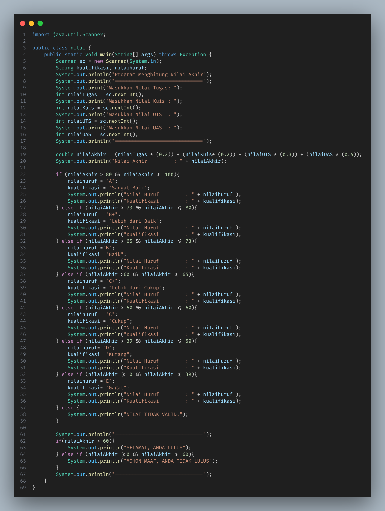

### Output Program

## 2.2 Perulangan
## 2.3.1 Praktikum Perulangan
## Pertanyaan
### 1. &nbsp;&nbsp;Buatlah program yang dapat menampilkan deretan bilangan dari angka 1 sampai n kecualiangka 6 dan 10, angka ganjil dicetak dengan asterik “*”, angka genap dicetak sesuai bilangan aslinya, dengan n = 2 digit terakhir NIM anda.*bila n<10 maka tambahkan 10 (n+=10)
### Contoh:
### Input NIM: 2341720102 maka n=12
### OUTPUT : * 2 * 4 * * 8 * * 12
### Contoh 2:
### Input NIM: 2341720113 maka n=13
### OUTPUT : * 2 * 4 * * 8 * * 12

## Kode Program
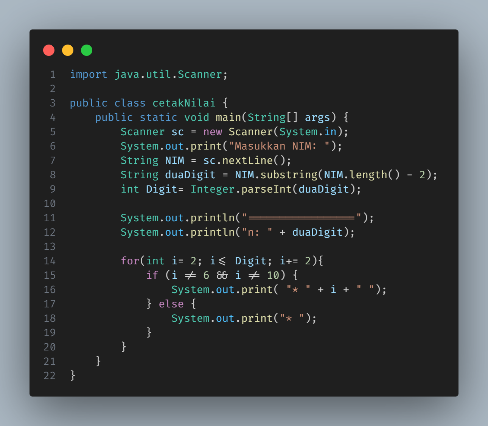

## Output
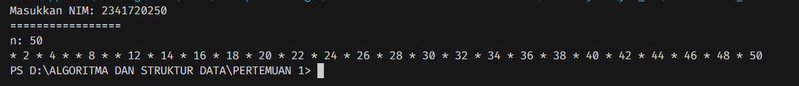

## 2.3 Array 
## 2.4.1 Praktikum Array
## Pertanyaan
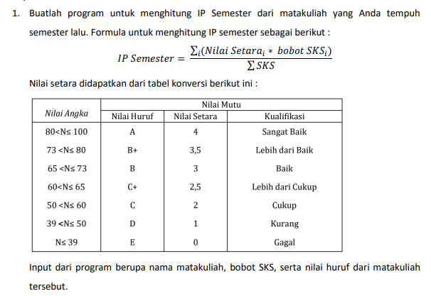

## Kode Program
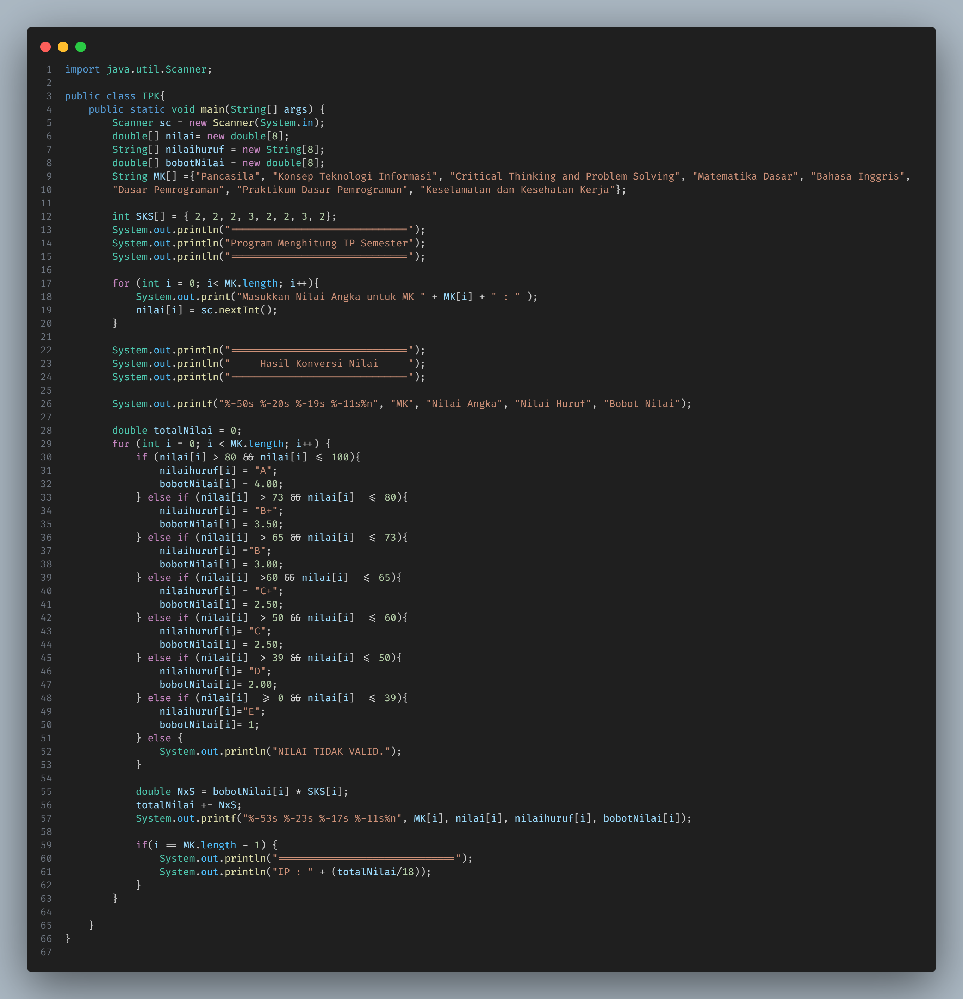

## Output
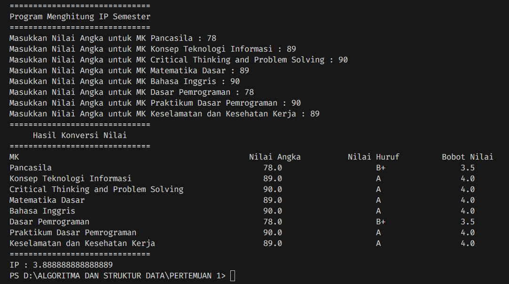

## 2.4 Fungsi
## 2.5.1 Praktikum Fungsi
## Pertanyaan

## Kode Program
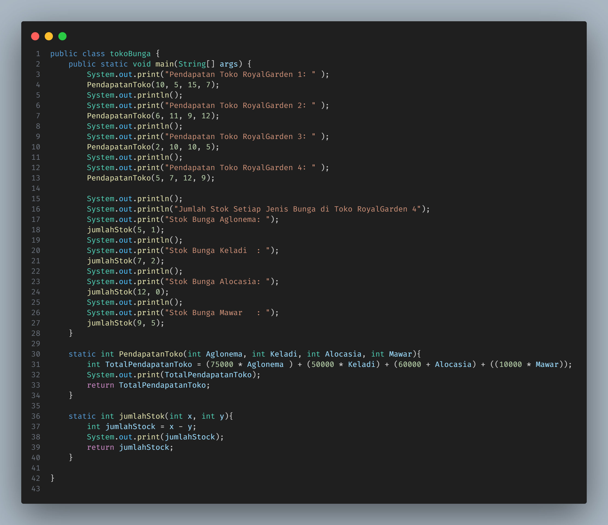

## Output
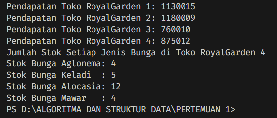

## Tugas Pertanyaan 1
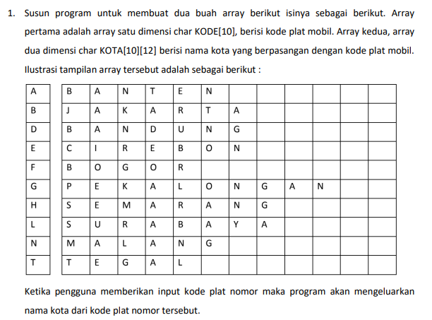

## Kode Program
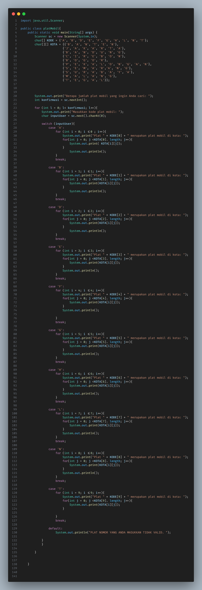

## Output
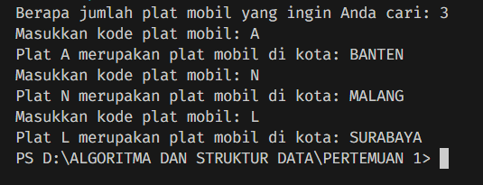

## Tugas Pertanyaan 2
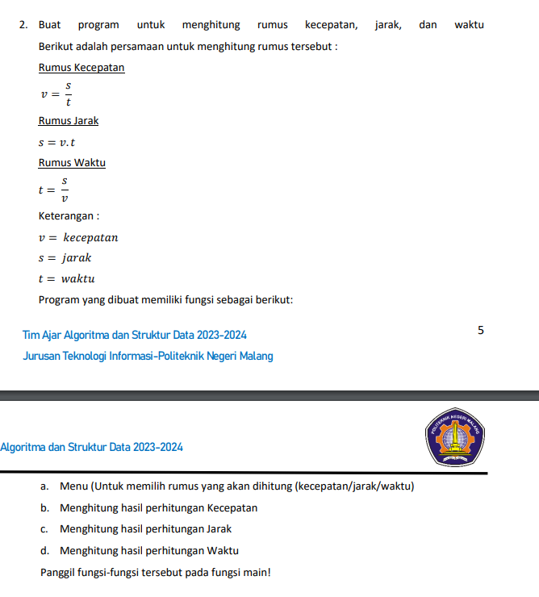

## Kode Program
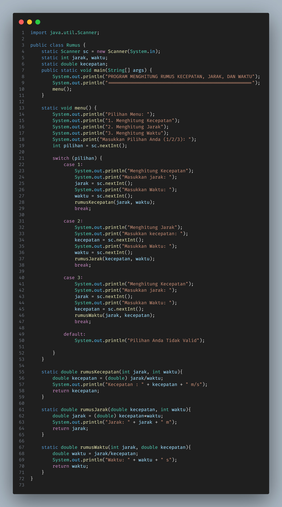

## Output
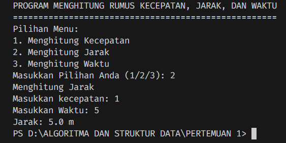

