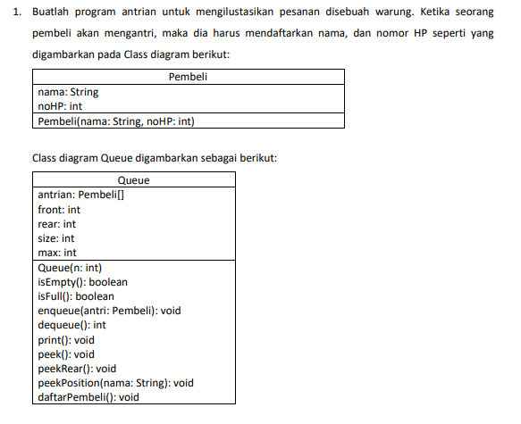

<h1 align="center">LAPORAN ALGORITMA DAN STRUKTUR DATA
PERTEMUAN  10 - QUEUE

<br>

</h1>

<h2>Nama &nbsp;&nbsp;&nbsp;&nbsp;&nbsp;&nbsp;&nbsp;:&nbsp;Afifah Khoirunnisa
<br>
Kelas &nbsp;&nbsp;&nbsp;&nbsp;&nbsp;&nbsp;&nbsp;&nbsp;:&nbsp;TI-1B
<br>
NIM&nbsp;&nbsp;&nbsp;&nbsp;&nbsp;&nbsp;&nbsp;&nbsp;&nbsp;&nbsp;:&nbsp;2341720250
<br>
No.Abs&nbsp;&nbsp;&nbsp;&nbsp;&nbsp;:&nbsp;03</h2>

## 10.2 PRAKTIKUM 1
## 10.2.1 Langkah-Langkah Percobaan
### Class QueueMain

```java
    package Praktikum1;
    import java.util.Scanner;

    public class QueueMain {
        public static void menu() {
            System.out.println("Masukkan operasi yang diinginkan: ");
            System.out.println("1. Enqueue");
            System.out.println("2. Dequeue");
            System.out.println("3. Print");
            System.out.println("4. Peek");
            System.out.println("5. Clear");
            System.out.println("--------------------------");
        }

        public static void main(String[] args) {
            Scanner sc03 = new Scanner(System.in);
            System.out.print("Masukkan kapasitas queue: ");
            int n = sc03.nextInt();

            Queue Q = new Queue(n);
            int pilih;

            do {
                menu();
                pilih = sc03.nextInt();
                switch (pilih){
                    case 1:
                        System.out.print("Masukkan data baru: ");
                        int dataMasuk = sc03.nextInt();
                        Q.Enqueue(dataMasuk);
                        break;

                    case 2:
                        int dataKeluar = Q.Dequeue();
                        if (dataKeluar != 0){
                            System.out.println("Data yang dikeluarkan");
                            break;
                        }

                    case 3:
                        Q.print();
                        break;
                    
                    case 4:
                        Q.peek();
                        break;

                    case 5:
                        Q.clear();
                        break;
                }
            } while (pilih == 1 || pilih == 2 || pilih == 3 || pilih == 4 || pilih == 5);
        }
    }

```java
    package Praktikum1;

    public class Queue {
        int[] data;
        int front;
        int rear;
        int size;
        int max;

        public Queue(int n){
            max = n;
            data = new int[max];
            size = 0;
            front = rear = -1;
        }

        public boolean IsEmpty(){
            if (size == 0){
                return true;
            } else {
                return false;
            }
        }

        public boolean IsFull(){
            if (size == max){
                return true;
            } else {
                return false;
            }
        }


        public void peek(){
            if (!IsEmpty()){
                System.out.println("Elemen Terdepan: " + data[front]);
            } else {
                System.out.println("Queue masih kosong");
            }
        }

        public void print(){
            if (IsEmpty()){
                System.out.println("Queue masih kosong");
            } else {
                int i = front;
                while (i != rear){
                    System.out.println(data[i] + " ");
                    i = (i + 1) % max;
                }
                System.out.println(data[i] + " ");
                System.out.println("Jumlah elemen = " + size);
            }
        }

        public void clear() {
            if (!IsEmpty()){
                front = rear = -1;
                size = 0;
                System.out.println("Queue berhasil dikosongkan");
            } else {
                System.out.println("Queue masih kosong");
            }
        }

        public void Enqueue (int dt) {
            if (IsFull()) {
                System.out.println("Queue sudah penuh");
            } else {
                if (IsEmpty()){
                    front = rear = 0;
                } else {
                    if (rear == max - 1) {
                        rear = 0;
                    } else {
                        rear++;
                    }
                }
                data[rear] = dt;
                size++;
            }
        }

        public int Dequeue(){
            int dt = 0;
            if (IsEmpty()) {
                System.out.println("Queue masih kosong");
            } else {
                dt = data[front];
                size--;
                if(IsEmpty()) {
                    front = rear = -1;
                } else {
                    if (front == max -1){
                        front = 0;
                    } else {
                        front++;
                    }
                }
            }
            return dt;
        }
    }
```
### Class Queue
## 10.2.2 Verifikasi Hasil Percobaan
```
    Masukkan kapasitas queue: 4
    Masukkan operasi yang diinginkan: 
    1. Enqueue
    2. Dequeue
    3. Print
    4. Peek
    5. Clear
    --------------------------
    1
    Masukkan data baru: 15
    Masukkan operasi yang diinginkan: 
    1. Enqueue
    2. Dequeue
    3. Print
    4. Peek
    5. Clear
    --------------------------
    1
    Masukkan data baru: 31
    Masukkan operasi yang diinginkan:
    1. Enqueue
    2. Dequeue
    3. Print
    4. Peek
    5. Clear
    --------------------------
    4
    Elemen Terdepan: 15
    Masukkan operasi yang diinginkan:
    1. Enqueue
    2. Dequeue
    3. Print
    4. Peek
    5. Clear
    --------------------------
    4
    Elemen Terdepan: 15
```

## 10.2.3 Pertanyaan
### 1. Pada konstruktor, mengapa nilai awal atribut front dan rear bernilai -1, sementara atribut size bernilai 0?
### Jawaban:
Pada konstruktor, nilai awal atribut front dan rear diatur menjadi -1 karena dalam struktur data queue, -1 menandakan bahwa antrian kosong. Sedangkan atribut size diatur menjadi 0 karena pada awalnya tidak ada elemen yang masuk ke dalam antrian.

### 2. Pada method Enqueue, jelaskan maksud dan kegunaan dari potongan kode berikut!
```java
    if (rear == max - 1) {
        rear = 0;
```
### Jawaban:
Potongan kode if (rear == max - 1) { rear = 0; } digunakan untuk menangani kondisi di mana rear (ujung belakang) queue sudah mencapai batas maksimum (max - 1). Jika kondisi ini terpenuhi, rear diatur kembali ke indeks awal (0), sehingga elemen dapat dimasukkan ke dalam queue dari awal.

### 3. Pada method Dequeue, jelaskan maksud dan kegunaan dari potongan kode berikut!
```java
    if (front == max - 1) {
        front = 0;
```
### Jawaban:
Potongan kode if (front == max - 1) { front = 0; } digunakan untuk menangani kondisi di mana front (ujung depan) queue sudah mencapai batas maksimum (max - 1). Jika kondisi ini terpenuhi, front diatur kembali ke indeks awal (0), sehingga elemen dapat dikeluarkan dari queue dari awal.

### 4. Pada method print, mengapa pada proses perulangan variabel i tidak dimulai dari 0 (int i=0), melainkan int i=front?
### Jawaban:
Pada method print, proses perulangan dimulai dari nilai front karena front menunjukkan pada indeks elemen terdepan dalam queue. Dengan memulai perulangan dari nilai front, kita dapat memastikan bahwa elemen-elemen yang dicetak dimulai dari elemen terdepan dan diurutkan sesuai dengan struktur queue.

### 5. Perhatikan kembali method print, jelaskan maksud dari potongan kode berikut!
```java
    i = (i+1) %max;
```
### Jawaban:
Potongan kode i = (i+1) % max; digunakan untuk memindahkan indeks i ke elemen berikutnya dalam queue dengan memanfaatkan operator modulo (%). Ini berguna karena ketika i mencapai batas maksimum (max - 1), operasi i+1 akan membuat i kembali ke indeks awal (0), memungkinkan perulangan queue berlanjut.

### 6. Tunjukkan potongan kode program yang merupakan queue overflow!
### Jawaban:
Queue overflow terjadi ketika mencoba menambahkan elemen baru ke dalam queue yang sudah penuh. Potongan kode program yang menyebabkan overflow adalah saat memanggil method Enqueue ketika queue sudah penuh, yaitu ketika kondisi IsFull() bernilai true.

### 7. Pada saat terjadi queue overflow dan queue underflow, program tersebut tetap dapat berjalan dan hanya menampilkan teks informasi. Lakukan modifikasi program sehingga pada saat terjadi queue overflow dan queue underflow, program dihentikan.
### Jawaban:
Untuk menghentikan program saat terjadi queue overflow dan queue underflow, kita dapat menambahkan perintah System.exit(0); setelah mencetak pesan informasi pada kondisi tersebut.

## 10.3.1 Langkah-Langkah Percobaan
### Class Nasabah
```java
    package Praktikum2;

    public class Nasabah {
        String norek, nama, alamat;
        int umur;
        double saldo;

        Nasabah[] data;
        int front;
        int rear;
        int size;
        int max;

        Nasabah (String norek, String nama, String alamat, int umur, double saldo){
            this.norek = norek;
            this.nama = nama;
            this.alamat = alamat;
            this.umur = umur;
            this.saldo = saldo;
        }

        Nasabah () {

        }

        public Nasabah(int n){
            max = n;
            data = new Nasabah[max];
            size = 0;
            front = rear = -1;
        }

        public boolean IsEmpty(){
            if (size == 0){
                return true;
            } else {
                return false;
            }
        }

        public boolean IsFull(){
            if (size == max){
                return true;
            } else {
                return false;
            }
        }


        public void peek(){
            if (!IsEmpty()){
                System.out.println("Elemen Terdepan: " + data[front].norek + " " + data[front].nama + " " + data[front].alamat + " " + data[front].umur + " " + data[front].saldo);
            } else {
                System.out.println("Queue masih kosong");
            }
        }

        public void print(){
            if (IsEmpty()){
                System.out.println("Queue masih kosong");
            } else {
                int i = front;
                while (i != rear){
                    System.out.println(data[i].norek + " " + data[i].nama + " " + data[i].alamat + " " + data[i].umur + " " + data[i].saldo); 
                    i = (i + 1) % max;
                }
                System.out.println(data[i].norek + " " + data[i].nama + " " + data[i].alamat + " " + data[i].umur + " " + data[i].saldo);
                System.out.println("Jumlah elemen = " + size);
            }
        }

        public void clear() {
            if (!IsEmpty()){
                front = rear = -1;
                size = 0;
                System.out.println("Queue berhasil dikosongkan");
            } else {
                System.out.println("Queue masih kosong");
            }
        }

        public void Enqueue (Nasabah dt) {
            if (IsFull()) {
                System.out.println("Queue sudah penuh");
            } else {
                if (IsEmpty()){
                    front = rear = 0;
                } else {
                    if (rear == max - 1) {
                        rear = 0;
                    } else {
                        rear++;
                    }
                }
                data[rear] = dt;
                size++;
            }
        }

        public Nasabah Dequeue(){
            Nasabah dt = new Nasabah();
            if (IsEmpty()) {
                System.out.println("Queue masih kosong");
            } else {
                dt = data[front];
                size--;
                if(IsEmpty()) {
                    front = rear = -1;
                } else {
                    if (front == max -1){
                        front = 0;
                    } else {
                        front++;
                    }
                }
            }
            return dt;
        }

    }
```

### Class QueueMain
```java
    package Praktikum2;
    import java.util.Scanner;

    public class QueueMain {
        public static void menu() {
            System.out.println("Masukkan operasi yang diinginkan: ");
            System.out.println("1. Antrian baru");
            System.out.println("2. Antrian keluar");
            System.out.println("3. Cek Antrian Terdepan");
            System.out.println("4. Cek Semua Antrian");
            System.out.println("--------------------------");
        }

        public static void main(String[] args) {
            Scanner sc03 = new Scanner(System.in);
            System.out.print("Masukkan kapasitas Queue: ");
            int jumlah = sc03.nextInt();
            Nasabah antri = new Nasabah(jumlah);
            int pilih;

            do {
                menu();
                pilih = sc03.nextInt();
                switch(pilih){
                    case 1:
                        System.out.print("No rekening   : ");
                        String norek = sc03.nextLine();
                        sc03.nextLine();
                        System.out.print("Nama          : ");
                        String nama = sc03.nextLine();
                        System.out.print("Alamat        : ");
                        String alamat = sc03.nextLine();
                        System.out.print("Umur          : ");
                        int umur = sc03.nextInt();
                        System.out.print("Saldo         : ");
                        double saldo = sc03.nextDouble();
                        Nasabah nb = new Nasabah(norek, nama, alamat, umur, saldo);
                        sc03.nextLine();
                        antri.Enqueue(nb);
                        break;

                    case 2:
                        Nasabah data = antri.Dequeue();
                        if (!"".equals(data.norek) && !"".equals(data.nama) && !"".equals(data.alamat) && data.umur != 0 && data.saldo != 0) {
                            System.out.println("Antrian yang keluar: " + data.norek + " " + data.nama + " " + data.alamat + " " + data.umur + " " + data.saldo);
                        break;
                        }
                    
                    case 3:
                        antri.peek();
                        break;
                    
                    case 4:
                        antri.print();
                        break;    
                }
            } while (pilih == 1 || pilih == 2 || pilih == 3 || pilih == 4);

        }
    }
``` 

### 10.3.2 Verifikasi Hasil Percobaan
```
    Masukkan kapasitas Queue: 8
    Masukkan operasi yang diinginkan: 
    1. Antrian baru
    2. Antrian keluar
    3. Cek Antrian Terdepan
    4. Cek Semua Antrian
    --------------------------
    1
    No rekening   : 12345
    Nama          : Dewi
    Alamat        : Malang
    Umur          : 23
    Saldo         : 1300000
    Masukkan operasi yang diinginkan: 
    1. Antrian baru
    2. Antrian keluar
    3. Cek Antrian Terdepan
    4. Cek Semua Antrian
    --------------------------
    1
    No rekening   : 32940
    Nama          : Susan
    Alamat        : Surabaya
    Umur          : 39
    Saldo         : 42000000
    Masukkan operasi yang diinginkan:
    1. Antrian baru
    2. Antrian keluar
    3. Cek Antrian Terdepan
    4. Cek Semua Antrian
    --------------------------
    4
    Dewi Malang 23 1300000.0
    Susan Surabaya 39 4.2E7
    Jumlah elemen = 2
    Masukkan operasi yang diinginkan:
    1. Antrian baru
    2. Antrian keluar
    3. Cek Antrian Terdepan
    4. Cek Semua Antrian
    --------------------------
    PS D:\ALGORITMA DAN STRUKTUR DATA\PERTEMUAN 10> 
```
## 10.3.3 Pertanyaan
### 1. Pada class QueueMain, jelaskan fungsi IF pada potongan kode program berikut!
```java
    if (!"".equals(data.norek) && !"".equals(data.nama) && !"".equals(data.alamat) && data.umur != 0 && data.saldo != 0) {
        System.out.println("Antrian yang keluar: " + data.norek + " " + data.nama + " " + data.alamat + " " + data.umur + " " + data.saldo);
        break;
    }
```
### Jawaban
Program tersebut merupakan bentuk pemilihan, jika data yang diisikan berupa nomor rekening, nama, alamat, dan saldo tidak kosong, maka program akan mencetak informasi antrian yang keluar yang terdiri dari nomor rekening, nama, alamat, umur dan saldo, setelah itu, program akan keluar dari list.

### 2. Lakukan modifikasi program dengan menambahkan method baru bernama peekRear pada class Queue yang digunakan untuk mengecek antrian yang berada di posisi belakang! Tambahkan pula daftar menu 5. Cek Antrian paling belakang pada class QueueMain sehingga method peekRear dapat dipanggil!
### Jawaban:
### Kode Program
```java
    public void peekRear(){
            int behind = front + (size - 1);
            if (!IsEmpty()){
                System.out.println("Elemen Terbelakang: " + data[behind].norek + " " + data[behind].nama + " " + data[behind].alamat + " " + data[behind].umur + " " + data[behind].saldo);
            } else {
                System.out.println("Queue masih kosong");
            }
        }
```

### Output:
```
    Masukkan kapasitas Queue: 8
    Masukkan operasi yang diinginkan:
    1. Antrian baru
    2. Antrian keluar
    3. Cek Antrian Terdepan
    4. Cek Semua Antrian
    5. Cek Antrian Terbelakang
    --------------------------

    1
    No rekening   : 12345
    Nama          : Dewi
    Alamat        : Malang
    Umur          : 23
    Saldo         : 1300000
    Masukkan operasi yang diinginkan:
    1. Antrian baru
    2. Antrian keluar
    3. Cek Antrian Terdepan
    4. Cek Semua Antrian
    5. Cek Antrian Terbelakang
    --------------------------
    1
    No rekening   : 32940
    Nama          : Susan
    Alamat        : Surabaya
    Umur          : 39
    Saldo         : 4200000
    Masukkan operasi yang diinginkan:
    1. Antrian baru
    2. Antrian keluar
    3. Cek Antrian Terdepan
    4. Cek Semua Antrian
    5. Cek Antrian Terbelakang
    --------------------------
    1
    No rekening   : 34789
    Nama          : Afifah
    Alamat        : Nganjuk
    Umur          : 19
    Saldo         : 1300000
    Masukkan operasi yang diinginkan:
    1. Antrian baru
    2. Antrian keluar
    3. Cek Antrian Terdepan
    4. Cek Semua Antrian
    5. Cek Antrian Terbelakang
    --------------------------
    5
    Elemen Terbelakang:  Afifah Nganjuk 19 1300000.0
    Masukkan operasi yang diinginkan:
    1. Antrian baru
    2. Antrian keluar
    3. Cek Antrian Terdepan
    4. Cek Semua Antrian
    5. Cek Antrian Terbelakang
    --------------------------
    PS D:\ALGORITMA DAN STRUKTUR DATA\PERTEMUAN 10> 
```
## 10.4 Tugas


### KODE PROGRAM CLASS QUEUE MAIN
```java
    package Tugas;

    import java.util.Scanner;

    public class QueueMain {
        public static void menu() {
            System.out.println("Masukkan operasi yang diinginkan: ");
            System.out.println("1. Pembeli baru");
            System.out.println("2. Pembeli keluar");
            System.out.println("3. Cek Antrian Terdepan");
            System.out.println("4. Cek Semua Pembeli");
            System.out.println("5. Cek Antrian Terbelakang");
            System.out.println("6. Cari Pembeli");
            System.out.println("--------------------------");
        }

        public static void main(String[] args) {
            Scanner sc = new Scanner(System.in);
            System.out.print("Masukkan kapasitas Queue: ");
            int jumlah = sc.nextInt();
            sc.nextLine(); 
            
            Queue antri = new Queue(jumlah);
            int pilih;
            
            do {
                menu();
                pilih = sc.nextInt();
                sc.nextLine(); 
                switch(pilih){
                    case 1:
                        System.out.print("Nama          : ");
                        String nama = sc.nextLine();
                        System.out.print("No. Hp        : ");
                        int noHp = sc.nextInt();
                        sc.nextLine(); 
                        Pembeli pembeliBaru = new Pembeli(nama, noHp);
                        antri.Enqueue(pembeliBaru);
                        break;
            
                    case 2:
                        if (!antri.IsEmpty()) {
                            Pembeli pembeliKeluar = antri.Dequeue();
                            System.out.println("Antrian yang keluar: " + pembeliKeluar.nama + " " + pembeliKeluar.noHp);
                        } else {
                            System.out.println("Queue masih kosong");
                        }
                        break;
                    
                    case 3:
                        antri.peek();
                        break;
                    
                    case 4:
                        antri.print();
                        break;
                        
                    case 5:
                        antri.peekRear();
                        break;
                        
                    case 6:
                        System.out.print("Masukkan nama pembeli: ");
                        String cari = sc.nextLine();
                        antri.peekPosition(cari);
                        break;
                }
            } while (pilih >= 1 && pilih <= 6);
        }
        
        
    }
```

### KODE PROGRAM CLASS QUEUE
```java
    package Tugas;

    public class Queue {
        Pembeli[] antrian;
        int front, rear, size, max;

        public Queue(int n){
            max = n;
            antrian = new Pembeli[max];
            size = 0;
            front = rear = -1;
        }


        public boolean IsEmpty(){
            if (size == 0){
                return true;
            } else {
                return false;
            }
        }

        public boolean IsFull(){
            if (size == max){
                return true;
            } else {
                return false;
            }
        }

        public void Enqueue (Pembeli antri) {
            if (IsFull()) {
                System.out.println("Queue sudah penuh");
            } else {
                if (IsEmpty()){
                    front = rear = 0;
                } else {
                    if (rear == max - 1) {
                        rear = 0;
                    } else {
                        rear++;
                    }
                }
                antrian[rear] = antri;
                size++;
            }
        }

        public Pembeli Dequeue(){
            Pembeli dt = new Pembeli();
            if (IsEmpty()) {
                System.out.println("Queue masih kosong");
            } else {
                dt = antrian[front];
                size--;
                if(IsEmpty()) {
                    front = rear = -1;
                } else {
                    if (front == max -1){
                        front = 0;
                    } else {
                        front++;
                    }
                }
            }
            return dt;
        }

        public void print(){
            if (IsEmpty()){
                System.out.println("Queue masih kosong");
            } else {

                int i = front;
                while (i != rear){
                    System.out.println(antrian[i].nama + " " + antrian[i].noHp);
                    i = (i + 1) % max;
                }
                System.out.println(antrian[i].nama + " " + antrian[i].noHp);
                System.out.println("Jumlah elemen = " + size);
            }
        }

        public void peek(){
            if (!IsEmpty()){
                System.out.println("Elemen Terdepan: " + antrian[front].nama + " " + antrian[front].noHp);
            } else {
                System.out.println("Queue masih kosong");
            }
        }

        public void peekRear(){
            int behind = front + (size - 1);
            if (!IsEmpty()){
                System.out.println("Elemen Terbelakang: " + antrian[behind].nama + " " + antrian[behind].noHp);
            } else {
                System.out.println("Queue masih kosong");
            }
        }
        

        public void peekPosition(String cari){
            for (int i = 0; i < size; i++) {
                if (antrian[i].nama.equals(cari)) {
                    System.out.println("Pembeli " + cari + " ditemukan pada posisi: " + i+1);
                    return;
                }
            }
            System.out.println("Pembeli " + cari + " tidak ditemukan dalam antrian.");
        }
        
        

        public void daftarPembeli(){
            if (IsEmpty()){
                System.out.println("Queue masih kosong");
            } else {
                System.out.println("Daftar semua pembeli: ");
                int i = front;
                while (i != rear){
                    System.out.println(antrian[i].nama + " " + antrian[i].noHp);
                    i = (i + 1) % max;
                }
                System.out.println(antrian[i].nama + " " + antrian[i].noHp);
                System.out.println("Jumlah elemen = " + size);
            }
        }
        

    }
```

### KODE PROGRAM CLASS PEMBELI
```java
    package Tugas;

    public class Pembeli {
        String nama;
        int noHp;
        
        Pembeli(String nama, int noHp){
            this.nama = nama;
            this.noHp = noHp;
        }

        Pembeli(){

        }
    }
```

### OUTPUT
```
    Masukkan kapasitas Queue: 8
    Masukkan operasi yang diinginkan: 
    1. Pembeli baru
    2. Pembeli keluar
    3. Cek Antrian Terdepan
    4. Cek Semua Pembeli
    5. Cek Antrian Terbelakang
    6. Cari Pembeli
    --------------------------
    1
    Nama          : Afifah
    No. Hp        : 7756
    Masukkan operasi yang diinginkan: 
    1. Pembeli baru
    2. Pembeli keluar
    3. Cek Antrian Terdepan
    4. Cek Semua Pembeli
    5. Cek Antrian Terbelakang
    6. Cari Pembeli
    --------------------------
    1
    Nama          : Angga
    No. Hp        : 4423
    Masukkan operasi yang diinginkan: 
    1. Pembeli baru
    2. Pembeli keluar
    3. Cek Antrian Terdepan
    4. Cek Semua Pembeli
    5. Cek Antrian Terbelakang
    6. Cari Pembeli
    --------------------------
    1
    Nama          : Sarah
    No. Hp        : 7890
    Masukkan operasi yang diinginkan:
    1. Pembeli baru
    2. Pembeli keluar
    3. Cek Antrian Terdepan
    4. Cek Semua Pembeli
    5. Cek Antrian Terbelakang
    6. Cari Pembeli
    --------------------------
    1
    Nama          : Nafa
    No. Hp        : 4567
    Masukkan operasi yang diinginkan:
    1. Pembeli baru
    2. Pembeli keluar
    3. Cek Antrian Terdepan
    4. Cek Semua Pembeli
    5. Cek Antrian Terbelakang
    6. Cari Pembeli
    --------------------------
    3
    Elemen Terdepan: Afifah 7756
    Masukkan operasi yang diinginkan:
    1. Pembeli baru
    2. Pembeli keluar
    3. Cek Antrian Terdepan
    4. Cek Semua Pembeli
    5. Cek Antrian Terbelakang
    6. Cari Pembeli
    --------------------------
    4
    Afifah 7756
    Angga 4423
    Sarah 7890
    Nafa 4567
    Jumlah elemen = 4
    Masukkan operasi yang diinginkan:
    1. Pembeli baru
    2. Pembeli keluar
    3. Cek Antrian Terdepan
    4. Cek Semua Pembeli
    5. Cek Antrian Terbelakang
    6. Cari Pembeli
    --------------------------
    5
    Elemen Terbelakang: Nafa 4567
    Masukkan operasi yang diinginkan:
    1. Pembeli baru
    2. Pembeli keluar
    3. Cek Antrian Terdepan
    4. Cek Semua Pembeli
    5. Cek Antrian Terbelakang
    6. Cari Pembeli
    --------------------------
    6
    Masukkan nama pembeli: Doni
    Pembeli Doni tidak ditemukan dalam antrian.
    Masukkan operasi yang diinginkan:
    1. Pembeli baru
    2. Pembeli keluar
    3. Cek Antrian Terdepan
    4. Cek Semua Pembeli
    5. Cek Antrian Terbelakang
    6. Cari Pembeli
    --------------------------
    6
    Masukkan nama pembeli: Afifah
    Pembeli Afifah ditemukan pada posisi: 01
    Masukkan operasi yang diinginkan:
    1. Pembeli baru
    2. Pembeli keluar
    3. Cek Antrian Terdepan
    4. Cek Semua Pembeli
    5. Cek Antrian Terbelakang
    6. Cari Pembeli
    --------------------------
    2
    Antrian yang keluar: Afifah 7756
    Masukkan operasi yang diinginkan:
    1. Pembeli baru
    2. Pembeli keluar
    3. Cek Antrian Terdepan
    4. Cek Semua Pembeli
    5. Cek Antrian Terbelakang
    6. Cari Pembeli
    --------------------------
    7
    PS D:\ALGORITMA DAN STRUKTUR DATA\PERTEMUAN 10> 
```
