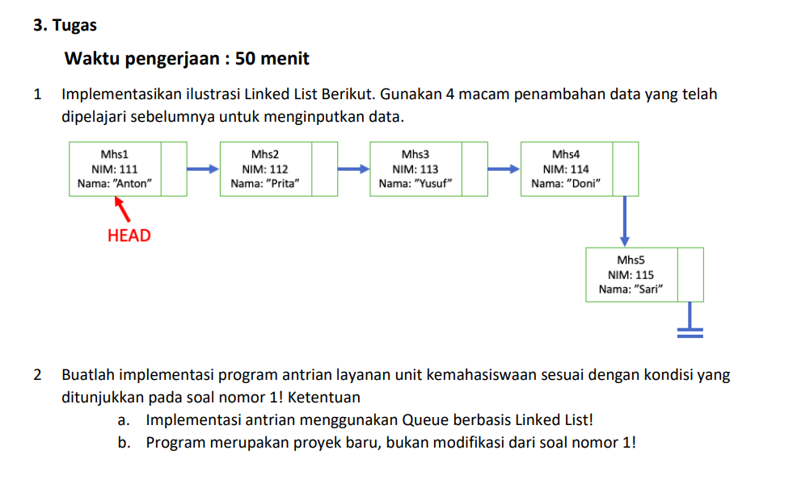

<h1 align="center">LAPORAN ALGORITMA DAN STRUKTUR DATA
PERTEMUAN  11 - LINKED LIST

<br>

</h1>

<h2>Nama &nbsp;&nbsp;&nbsp;&nbsp;&nbsp;&nbsp;&nbsp;:&nbsp;Afifah Khoirunnisa
<br>
Kelas &nbsp;&nbsp;&nbsp;&nbsp;&nbsp;&nbsp;&nbsp;&nbsp;:&nbsp;TI-1B
<br>
NIM&nbsp;&nbsp;&nbsp;&nbsp;&nbsp;&nbsp;&nbsp;&nbsp;&nbsp;&nbsp;:&nbsp;2341720250
<br>
No.Abs&nbsp;&nbsp;&nbsp;&nbsp;&nbsp;:&nbsp;03</h2>


## 2.1 Pembuatan Single Linked List
### Class Node
```java
    package minggu11;

    public class Node {
        int data;
        Node next;

        Node (int nilai, Node berikutnya){
            data = nilai;
            next = berikutnya;
        }

    }
```

### Class SingleLinkedList
```java
    package minggu11;

    public class SingleLinkedList {
        Node head, tail;

        boolean isEmpty(){
            return head == null;
        }

        void print(){
            if(!isEmpty()){
                Node tmp = head;
                System.out.print("Isi Linked List:      ");
                while (tmp != null){
                    System.out.print(tmp.data + "\t");
                    tmp = tmp.next;
                }
                System.out.println(" ");
            } else {
                System.out.println("linked List Kosong");
            }
        }

        void addFirst(int input){
            Node ndInput = new Node(input, null);
            if (isEmpty()){
                head = ndInput;
                tail = ndInput;

            } else {
                ndInput.next = head;
                head = ndInput;
            }
        }

        void addLast(int input) {
            Node ndInput = new Node(input, null);
            tail.next = ndInput;
            tail = ndInput;
        }

        void insertAfter(int key, int input) {
            Node ndInput = new Node(input, null);
            Node temp = head;
            while (temp != null) {
                if (temp.data == key) {
                    ndInput.next = temp.next;
                    temp.next = ndInput;
                    if (ndInput.next == tail) {
                        tail = ndInput;
                    }
                    break;
                }
                temp = temp.next;
            }
            if (temp == null) {
                System.out.println("Key " + key + " tidak ditemukan");
            }
        }
        
        void insertAt (int index, int input){
        Node temp = head;
        if (index < 0) {
            System.out.println("Indeks tidak valid!");
            return;
        } else if (index == 0) {
            addFirst(input);
            return;
        }
        for (int i = 0; i < index - 1 && temp != null; i++) {
            temp = temp.next;
        }
        if (temp == null) {
            System.out.println("Indeks melebihi panjang linked list!");
            return;
        }

        temp.next = new Node(input, temp.next);
        if(temp.next.next == null){
            tail = temp.next; 
            }
        }
    }
```
## 2.1.1 Verifikasi Hasil Percobaan
```
    linked List Kosong
    Isi Linked List:      890        
    Isi Linked List:      890       760      
    Isi Linked List:      700       890     760      
    Isi Linked List:      700       999     890     760      
    Isi Linked List:      700       999     890     833     760      
    PS D:\ALGORITMA DAN STRUKTUR DATA\PERTEMUAN 11>
```
## 2.1.2 Pertanyaan
### 1. Mengapa hasil compile kode program di baris pertama menghasilkan “Linked List Kosong”?
### Jawaban: 
```
Karena belum ada data apapun yang dimasukkan dalam linked list. 
```
### 2. Jelaskan kegunaan variable temp secara umum pada setiap method!
### Jawaban: 
```
Variabel  "temp" sering digunakan untuk menyimpan referensi sementara ke node saat melakukan iterasi atau operasi tertentu, seperti pencarian, penyisipan, atau penghapusan. Dengan menggunakan "temp", kita dapat mengakses dan memanipulasi node saat ini tanpa mengubah atau kehilangan referensi ke node asli yang sedang diproses, sehingga memungkinkan untuk melakukan operasi dengan aman dan efisien.
```
### 3. Perhatikan class SingleLinkedList, pada method insertAt Jelaskan kegunaan kode berikut!
```java
    if(temp.next.next == null){
                tail = temp.next; 
    }
```
### Jawaban: 
```
Kode tersebut digunakan untuk memeriksa apakah node yang ditunjuk oleh `temp.next` adalah node terakhir dalam linked list atau tidak. Jika `temp.next.next` adalah `null`, ini menunjukkan bahwa `temp.next` adalah node terakhir dalam linked list, karena tidak ada node setelahnya. Dalam konteks ini, kode `tail = temp.next;` mengatur `tail` ke node terakhir dalam linked list, karena kita telah menyisipkan node baru setelah node `temp`, sehingga node baru tersebut sekarang menjadi node terakhir dalam linked list. Dengan cara ini, kita memastikan bahwa `tail` selalu menunjuk ke node terakhir yang valid dalam linked list setelah operasi penyisipan.
```

## 2.2 Modifikasi Elemeen Pada Single Linked List
## 2.2.1 Langkah-Langkah PErcobaan
### Class SingleLinkedList
```java
    int getData(int index){
        Node tmp = head;
        for(int i = 0; i<index; i++){
            tmp = tmp.next;
        }
        return tmp.data;
    }

    public int indexOf(int key) {
        Node temp = head;
        int index = 0;
        while(temp != null && temp.data != key) {
            temp = temp.next;
            index++;
        }
    
        if(temp == null) {
            return -1;
        } else {
            return index;
        }
    }

    public void removeFirst() {
        if(isEmpty()) {
            System.out.println("Linked List masih kosong, tidak dapat dihapus!");
        } else if(head == tail) {
            head = tail = null;
        } else {
            head = head.next;
        }
    }

    public void removeLast() {
        if(isEmpty()) {
            System.out.println("Linked List masih kosong, tidak dapat dihapus!");
        } else if(head == tail) {
            head = tail = null;
        } else {
            Node temp = head;
            while(temp.next != tail) {
                temp = temp.next;
            }
            temp.next = null;
            tail = temp;
        }
    }

    public void remove(int key) {
        if(isEmpty()) {
            System.out.println("Linked List masih kosong, tidak dapat dihapus!");
        } else {
            Node temp = head;
            while(temp != null) {
                if((temp.data == key) && (temp == head)) {
                    this.removeFirst();
                    break;
                } else if(temp.next.data == key) {
                    temp.next = temp.next.next;
                    if(temp.next == null) tail = temp;
                    break;
                }
                temp = temp.next;
            }
        }
    }

    public void removeAt(int index) {
        if(index < 0) {
            System.out.println("Indeks salah!");
        } else if(index == 0) {
            removeFirst();
        } else {
            Node temp = head;
            for(int i = 0; i < index - 1; i++) {
                if(temp.next == null) break;
                temp = temp.next;
            }
            temp.next = temp.next.next;
            if(temp.next == null) tail = temp;
        }
    }
```
### Class SLLMain
```java
System.out.println("Data pada index ke-1= " + singLL.getData(1));
        System.out.println("Data 3 berada pada index ke-"+singLL.indexOf(760));

        singLL.remove(999);
        singLL.print();
        singLL.removeAt(0);
        singLL.print();
        singLL.removeFirst();
        singLL.print();
        singLL.removeLast();
        singLL.print();
```
## 2.2.2 Verifikasi Hasil Percobaan
```
    linked List Kosong
    Isi Linked List:      890
    Isi Linked List:      890       760
    Isi Linked List:      700       890     760
    Isi Linked List:      700       999     890   760
    Isi Linked List:      700       999     890   833      760
    Data pada index ke-1= 999
    Data 3 berada pada index ke-4
    Isi Linked List:      700       890     833   760
    Isi Linked List:      890       833     760
    Isi Linked List:      833       760
    Isi Linked List:      833
    PS D:\ALGORITMA DAN STRUKTUR DATA\PERTEMUAN 11>
```

## 2.2.3 Pertanyaan
### 1. Mengapa digunakan keyword break pada fungsi remove? Jelaskan!
### Jawaban:
```
Keyword break digunakan pada fungsi remove untuk menghentikan iterasi lebih awal ketika node yang mengandung data yang cocok dengan kunci (key) ditemukan dan dihapus.
```
### 2. Jelaskan kegunaan kode dibawah ini pada method remove!
```java
else if(temp.next.data == key) {
                    temp.next = temp.next.next;
```
### Jawaban:
```
Kode ini digunakan untuk menghapus node dari linked list yang memiliki nilai data (data) yang cocok dengan kunci (key), namun bukan node pertama.
```

### Tugas


