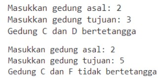

<h1 align="center">LAPORAN ALGORITMA DAN STRUKTUR DATA
PERTEMUAN  15 - GRAPH

<br>

</h1>

<h2>Nama &nbsp;&nbsp;&nbsp;&nbsp;&nbsp;&nbsp;&nbsp;:&nbsp;Afifah Khoirunnisa
<br>
Kelas &nbsp;&nbsp;&nbsp;&nbsp;&nbsp;&nbsp;&nbsp;&nbsp;:&nbsp;TI-1B
<br>
NIM&nbsp;&nbsp;&nbsp;&nbsp;&nbsp;&nbsp;&nbsp;&nbsp;&nbsp;&nbsp;:&nbsp;2341720250
<br>
No.Abs&nbsp;&nbsp;&nbsp;&nbsp;&nbsp;:&nbsp;03</h2>

## 2.1 Percobaan 1 : Implementasi Graph menggunakan Linked List
## 2.1.1 Langkah-langkah Percobaan
### Class Node
```java
    public class Node03 {
        int data;
        Node03 prev, next;
        int jarak;

        Node03(Node03 prev, int data, int jarak, Node03 next){
            this.prev = prev;
            this.data = data;
            this.jarak = jarak;
            this.next= next;
        }
    }
```
### Class DoubleLinkedList
```java
    public class DoubleLinkedList03 {
        Node03 head;
        int size;

        DoubleLinkedList03(){
            head = null;
            size = 0;
        }

        public boolean isEmpty(){
            return head == null;
        }

        public void addFirst(int item, int jarak){
            if(isEmpty()){
                head = new Node03(null, item, jarak, null);
            } else {
                Node03 newNode = new Node03(null, item, jarak, head);
                head.prev = newNode;
                head = newNode;
            }
            size++;
        }

        public int getJarak(int index) throws Exception{
            if(isEmpty() || index >= size){
                throw new Exception("Nilai index di luar batas");
            }

            Node03 tmp = head;
            for(int i = 0; i < index; i++){
                tmp = tmp.next;
            }
            return tmp.jarak;
        }

        public void addLast (int item, int jarak){
            if(isEmpty()){
                addFirst(item, jarak);
            } else {
                Node03 current = head;
                while (current.next != null){
                    current = current.next;
                }
                Node03 newNode = new Node03(current, item, jarak, null);
                current.next = newNode;
                size++;
            }
        }

        public void add(int item,  int jarak, int index) throws Exception {
            if(isEmpty()){
                addFirst(item, jarak);
            } else if (index < 0 || index > size){
                throw new Exception("Nilai indeks di luar batas");
            } else {
                Node03 current = head;
                int i = 0;
                while (i < index){
                    current = current.next;
                    i++;
                } 
                if(current.prev == null){
                    Node03 newNode = new Node03(null, item, jarak, current);
                    current.prev = newNode;
                    head = newNode;
                } else {
                    Node03 newNode = new Node03(current.prev, item, jarak, current);
                    newNode.prev = current.prev;
                    newNode.next = current;
                    newNode.prev.next = newNode;
                    current.prev = newNode;
                }
            }
            size++;
        }

        public int size(){
            return size;
        }

        public void clear(){
            head = null;
            size = 0;
        }

        public void print(){
            if(!isEmpty()){
                Node03 tmp = head;
                while (tmp != null){
                    System.out.print(tmp.data + "\t");
                    tmp = tmp.next;
                }
                System.out.println("\nberhasil diisi");
            } else {
                System.out.println("Linked lists Kosong");
            }
        }

        public void removeFirst() throws Exception {
            if (isEmpty()){
                throw new Exception("Linked List masih kosong, tidak dapat dihapus!");
            } else if (size == 1){
                removeLast();
            } else {
                head = head.next;
                head.prev = null;
                size--;
            }
        }

        public void removeLast() throws Exception {
            if (isEmpty()){
                throw new Exception("Linked List masih kosong, tidak dapat dihapus!");
            } else if (head.next == null){
                head = null;
                size--;
                return;
            }

            Node03 current = head;
            while (current.next.next != null) {
                current = current.next;
            }
            current.next = null;
            size--;
        }

        public void remove(int tujuan) throws Exception {
            if (isEmpty()) {
                throw new Exception("Linked List masih kosong, tidak dapat dihapus!");
            }

            Node03 current = head;
            while (current != null) {
                if (current.data == tujuan) {
                    if (current.prev != null) {
                        current.prev.next = current.next;
                    } else {
                        head = current.next;
                    }
                    if (current.next != null) {
                        current.next.prev = current.prev;
                    }
                    size--;
                    return;  // Keluar setelah menghapus satu elemen yang sesuai
                }
                current = current.next;
            }
            throw new Exception("Node dengan tujuan " + tujuan + " tidak ditemukan");
        }

        public int getFirst() throws Exception{
            if(isEmpty()){
                throw new Exception("Linked list kosong");
            }
            return head.data;
        }

        public int getLast() throws Exception {
            if(isEmpty()){
                throw new Exception("Linked list kosong");
            } 
            Node03 tmp = head;
            while (tmp.next != null){
                tmp = tmp.next;
            }
            return tmp.data;
        }

        public int get(int index) throws Exception {
            if (isEmpty() || index >= size){
                throw new Exception("Nilai indeks di luar batas.");
            }
            Node03 tmp = head;
            for (int i = 0; i < index; i++){
                tmp = tmp.next;
            }
            return tmp.data;
        }
    }
```
### Class Graph
```java
    public class Graph03 {
        int vertex;
        DoubleLinkedList03 list[];

        public Graph03(int v){
            vertex = v;
            list = new DoubleLinkedList03[v];
            for(int i = 0; i < v; i++){
                list[i] = new DoubleLinkedList03();
            }
        }

        public void addEdge(int asal, int tujuan, int jarak){
            list[asal].addFirst(tujuan, jarak);
            
            
        }

        public void degree(int asal) throws Exception{
            int k, totalIn = 0, totalOut = 0;
            for(int i = 0; i < vertex; i++){
                //inDegree
                for(int j = 0; j < list[i].size(); j++){
                    if(list[i].get(j) == asal){
                        ++totalIn;
                    }
                }
                //outDegree
                for(k = 0; k <list[asal].size(); k++){
                    list[asal].get(k);
                }
                totalOut = k;
            }
            System.out.println("InDegree dari Gedung " + (char)('A'+ asal) + ": " + totalIn);
            System.out.println("OutDegree dari Gedung " + (char)('A'+ asal) + ": " + totalOut);
            System.out.println("Degree dari Gedung " + (char)('A'+ asal) + ": " + (totalIn + totalOut));
        }

        public void removeEdge(int asal, int tujuan) throws Exception{
            for(int i = 0; i < vertex; i++){
                if(i==tujuan){
                    list[asal].remove(tujuan);
                }
            }
        }

        public void removeAllEdges(){
            for(int i = 0; i < vertex; i++){
                list[i].clear();
            }
            System.out.println("Graf berhasil dikosongkan");
        }

        public void printGraph() throws Exception{
            for(int i = 0; i < vertex; i++){
                if(list[i].size() > 0){
                    System.out.print("Gedung " + (char)('A' + i) + " terhubung dengan ");
                    for(int j = 0; j <list[i].size() ; j++){
                        System.out.print((char) ('A' + list[i].get(j)) + " (" + list[i].getJarak(j) + " m), ");
                    }
                    System.out.println("");
                }
            }
            System.out.println("");
        }
    }
```

## 2.1.2 Verifikasi Hasil Percobaan
### Hasil Running pada langkah 14
```
InDegree dari Gedung A: 0
OutDegree dari Gedung A: 2
Degree dari Gedung A: 2
Gedung A terhubung dengan C (100 m), B (50 m),     
Gedung B terhubung dengan D (70 m),
Gedung C terhubung dengan D (40 m),
Gedung D terhubung dengan E (60 m),
Gedung E terhubung dengan F (80 m),

PS D:\algoritma-dan-struktur-data\PERTEMUAN 15 - GRAPH>
```

### Hasil Running pada langkah 17
```
Gedung A terhubung dengan C (100 m), B (50 m),
Gedung C terhubung dengan D (40 m),
Gedung D terhubung dengan E (60 m),
Gedung E terhubung dengan F (80 m),

PS D:\algoritma-dan-struktur-data\PERTEMUAN 15 - GRAPH>
```
## 2.1.3 Pertanyaan
### 1. Perbaiki kode program Anda apabila terdapat error atau hasil kompilasi kode tidak sesuai!
### Jawaban: 
```
    Kode sudah saya betulkan sehingga kode diatas sudah benar sehingga dapat dijalankan.
```
### 2. Pada class Graph, terdapat atribut list[] bertipe DoubleLinkedList. Sebutkan tujuan pembuatan variabel tersebut!
### Jawaban: 
```
    Variabel tersebut berfungsi untuk menyimpan array objek dari DoubleLinkedList. Setiap elemen dalam array ini mewakili adjacency list dari suatu simpul (vertex) di graf.
```
### 3. Jelaskan alur kerja dari method removeEdge!
### Jawaban: 
```
    Method removeEdge menggunakan 2 parameter, yaitu asal dan tujuan. Dalam method tersebut, terjadi perulangan sehingga menemukan tujuan. Jika tujuan sudah ditemukan, maka list[asal] akan dihapus.
```
### 4. Apakah alasan pemanggilan method addFirst() untuk menambahkan data, bukan method add jenis lain saat digunakan pada method addEdge pada class Graph?
### Jawaban: 
```
    Karena method addFirst() memiliki algoritma pemrograman yang lebih simple sehingga lebih cocok digunakan pada method addEdge();
```
### 5. Modifikasi kode program sehingga dapat dilakukan pengecekan apakah terdapat jalur antara suatu node dengan node lainnya, seperti contoh berikut (Anda dapat memanfaatkan Scanner).


### Jawaban: 
```java
    public void sejalur(int asal, int tujuan) throws Exception {
            if (asal < 1 || asal > vertex || tujuan < 1 || tujuan > vertex) {
                System.out.println("Gedung tidak valid.");
                return;
            }
        
            boolean cektetangga = Math.abs(tujuan - asal) == 1 || Math.abs(tujuan - asal) == -1;
            
            if (cektetangga) {
                boolean bertetangga = false;
                for (int i = 0; i < list[asal - 1].size(); i++) {
                    if (list[asal - 1].get(i) == tujuan) {
                        bertetangga = true;
                        break; 
                    }
                }
                
                if (!bertetangga) {
                    System.out.print("Gedung " + (char)('A' + asal - 1) + " dan " + (char)('A' + tujuan - 1) + " bertetangga");
                } else {
                    System.out.print("Gedung " + (char)('A' + asal - 1) + " dan " + (char)('A' + tujuan - 1) + " tidak bertetangga");
                }
            } else {
                System.out.print("Gedung " + (char)('A' + asal - 1) + " dan " + (char)('A' + tujuan - 1) + " tidak bertetangga");
            }
        }
```
### Output:
```
    Masukkan Gedung Asal: 2
    Masukkan Gedung Tujuan: 3
    Gedung B dan C bertetangga
    PS D:\algoritma-dan-struktur-data\PERTEMUAN 15 - GRAPH> 
```
```
    Masukkan Gedung Asal: 1
    Masukkan Gedung Tujuan: 4
    Gedung A dan D tidak bertetangga
    PS D:\algoritma-dan-struktur-data\PERTEMUAN 15 - GRAPH>
```
## 2.2 Percobaan 2: Implementasi Graph menggunakan Matriks
## 2.2.1 Langkah-langkah Percobaan
### Class GraphMatriks
```java
    public class GraphMatriks03 {
        int vertex;
        int[][] matriks;

        public GraphMatriks03(int v){
            vertex = v;
            matriks = new int [v][v];
        }

        public void makeEdge(int asal, int tujuan, int jarak){
            matriks[asal][tujuan] = jarak;
        }

        public void removeEdge(int asal, int tujuan){
            matriks[asal][tujuan] = -1;
        }

        public void printGraph(){
            for(int i = 0; i < vertex; i++){
                System.out.print("Gedung " + (char)('A' + i) + ": ");
                for(int j = 0; j < vertex; j++){
                    if(matriks[i][j] != -1){
                        System.out.print("Gedung " + (char)('A' + j) + " (" + matriks[i][j] + " m),");
                    }
                }
                System.out.println();
            }
        }
    }
```
### Class GraphMain
```java
    GraphMatriks03 gdg = new GraphMatriks03(4);
            gdg.makeEdge(0, 1, 50);
            gdg.makeEdge(1, 0, 60);
            gdg.makeEdge(1, 2, 70);
            gdg.makeEdge(2, 1, 80);
            gdg.makeEdge(2, 3, 40);
            gdg.makeEdge(3, 0, 90);
            gdg.printGraph();
            System.out.println("Hasil penghapusan Edge");
            gdg.removeEdge(2, 1);
            gdg.printGraph();
```
## 2.2.2 Verifikasi Hasil Percobaan
```
    Gedung A: Gedung A (0 m),Gedung B (50 m),Gedung C (0 m),Gedung D (0 m),
    Gedung B: Gedung A (60 m),Gedung B (0 m),Gedung C (70 m),Gedung D (0 m),
    Gedung C: Gedung A (0 m),Gedung B (80 m),Gedung C (0 m),Gedung D (40 m),
    Gedung D: Gedung A (90 m),Gedung B (0 m),Gedung C (0 m),Gedung D (0 m),
    Hasil penghapusan Edge
    Gedung A: Gedung A (0 m),Gedung B (50 m),Gedung C (0 m),Gedung D (0 m),
    Gedung B: Gedung A (60 m),Gedung B (0 m),Gedung C (70 m),Gedung D (0 m),
    Gedung C: Gedung A (0 m),Gedung C (0 m),Gedung D (40 m),
    Gedung D: Gedung A (90 m),Gedung B (0 m),Gedung C (0 m),Gedung D (0 m),
    PS D:\algoritma-dan-struktur-data\PERTEMUAN 15 - GRAPH> 
```
## 2.2.3 Pertanyaan
### 1. Perbaiki kode program Anda apabila terdapat error atau hasil kompilasi kode tidak sesuai!
### Jawaban: 
```java
public void removeEdge(int asal, int tujuan){
        matriks[asal][tujuan] = 0;
    }
```
### Berikut Output yang benar:
```
    Gedung A: Gedung A (0 m),Gedung B (50 m),Gedung C (0 m),Gedung D (0 m),     
    Gedung B: Gedung A (60 m),Gedung B (0 m),Gedung C (70 m),Gedung D (0 m),    
    Gedung C: Gedung A (0 m),Gedung B (80 m),Gedung C (0 m),Gedung D (40 m),    
    Gedung D: Gedung A (90 m),Gedung B (0 m),Gedung C (0 m),Gedung D (0 m),     
    Hasil penghapusan Edge
    Gedung A: Gedung A (0 m),Gedung B (50 m),Gedung C (0 m),Gedung D (0 m),     
    Gedung B: Gedung A (60 m),Gedung B (0 m),Gedung C (70 m),Gedung D (0 m),    
    Gedung C: Gedung A (0 m),Gedung B (0 m),Gedung C (0 m),Gedung D (40 m),     
    Gedung D: Gedung A (90 m),Gedung B (0 m),Gedung C (0 m),Gedung D (0 m),     
    PS D:\algoritma-dan-struktur-data\PERTEMUAN 15 - GRAPH> 
```
### 2. Apa jenis graph yang digunakan pada Percobaan 2?
### Jawaban: 
```
    Graph dengan menggunakan matriks
```
### 3. Apa maksud dari dua baris kode berikut?
```java
    gdg.makeEdge(1,2,70);
    gdg.makeEdge(2,1,80);
```
### Jawaban: 
```
    Kedua baris kode tersebut menunjukkan pembuatan edge atau koneksi antara dua gedung dalam graf.

    Baris pertama gdg.makeEdge(1, 2, 70); membuat edge dari gedung 1 ke gedung 2 dengan jarak 70. Ini menunjukkan bahwa gedung 1 terhubung ke gedung 2 dengan jarak 70 meter.

    Baris kedua gdg.makeEdge(2, 1, 80); membuat edge dari gedung 2 ke gedung 1 dengan jarak 80. Ini menunjukkan bahwa gedung 2 terhubung ke gedung 1 dengan jarak 80 meter.
```
### 4. Modifikasi kode program sehingga terdapat method untuk menghitung degree, termasuk inDegree dan outDegree!
### Jawaban: 
```java
    public void degreeMatriks(int asal) throws Exception {
        int totalIn = 0, totalOut = 0;
    
        // InDegree
        for (int i = 0; i < vertex; i++) {
            if (matriks[i][asal] != 0) {
                totalIn++;
            }
        }
    
        // OutDegree
        for (int j = 0; j < vertex; j++) {
            if (matriks[asal][j] != 0) {
                totalOut++;
            }
        }
    
        System.out.println("InDegree dari Gedung " + (char)('A' + asal) + ": " + totalIn);
        System.out.println("OutDegree dari Gedung " + (char)('A' + asal) + ": " + totalOut);
        System.out.println("Degree dari Gedung " + (char)('A' + asal) + ": " + (totalIn + totalOut));
    }
```


## 3. Latihan Praktikum

### 1. Modifikasi kode program pada class GraphMain sehingga terdapat menu program yang bersifat dinamis, setidaknya terdiri dari:
### a) Add Edge
### b) Remove Edge
### c) Degree
### d) Print Graph
### e) Cek Edge
### Pengguna dapat memilih menu program melalui input Scanner
### Jawaban: 
```java
    import java.util.Scanner;

    public class GraphMain03 {
    
    public static void main(String[] args) throws Exception{
        Scanner sc03 = new Scanner(System.in);
        Graph03 gedung = new Graph03(6);
        boolean graph = true;

        while(graph){
            System.out.println("==========================");
            System.out.println("           GRAPH         ");
            System.out.println("==========================");
            System.out.println("1. Add Edge");
            System.out.println("2. Remove Edge");
            System.out.println("3. Degree");
            System.out.println("4. Print Graph");
            System.out.println("5. Cek Edge");
            System.out.println("6. Update Jarak Edge");
            System.out.println("7. Hitung jumlah Edge dalam graph");
            System.out.println("8. Keluar");
            System.out.print("Masukkan pilihan Anda: ");
            int pilihan = sc03.nextInt();

            switch(pilihan){
                case 1: 
                    System.out.print("Masukkan Asal Edge: ");
                    int asal = sc03.nextInt();
                    System.out.print("Masukkan Tujuan Edge: ");
                    int tujuan = sc03.nextInt();
                    System.out.print("Masukkan Jarak Edge: ");
                    int jarak = sc03.nextInt();
                    gedung.addEdge(asal, tujuan, jarak);
                    System.out.println("Edge baru telah dimasukkan!!");
                    System.out.println();
                    break;

                case 2:
                    System.out.println("1. Hapus semua Edge");
                    System.out.println("2. Hapus edge tertentu");
                    System.out.print("Masukkan pilihan Anda: ");
                    pilihan = sc03.nextInt();

                    switch(pilihan){
                        case 1:
                            gedung.removeAllEdges();
                            System.out.println("Semua Edge Telah dihapus!");
                            break;
                        
                        case 2:
                            System.out.println("Masukkan Edge yang ingin Anda Hapus");
                            System.out.print("Asal Edge: ");
                            asal = sc03.nextInt();
                            System.out.print("Tujuan Edge: ");
                            tujuan = sc03.nextInt();
                            gedung.removeEdge(asal, tujuan);
                            System.out.println("Edge berhasil dihapus!!");
                            break;

                        default:
                            System.out.println("Pilihan Anda tidak valid");
                            break;
                    }
                    break;

                case 3:
                    System.out.print("Masukkan degree yang ingin Anda cari: ");
                    int degree = sc03.nextInt();
                    gedung.degree(degree);
                    break;

                case 4:
                    System.out.println("Daftar Graph: ");
                    gedung.printGraph();
                    break;

                case 5:
                    System.out.println("Cek Edge: ");
                    System.out.print("Masukkan Gedung Asal: ");
                    asal = sc03.nextInt();
                    System.out.print("Masukkan Gedung Tujuan: ");
                    tujuan = sc03.nextInt();
                    gedung.cekGraph(asal, tujuan);
                    break;

                case 6:
                    System.out.print("Masukkan Gedung Asal: ");
                    asal = sc03.nextInt();
                    System.out.print("Masukkan Gedung Tujuan: ");
                    tujuan = sc03.nextInt();
                    System.out.print("Masukkan Jarak Baru: ");
                    jarak = sc03.nextInt();
                    gedung.updateJarak(asal - 1, tujuan - 1, jarak);
                    System.out.println("Jarak baru telah di update!");
                    break;

                case 7: 
                    System.out.println("Menghitung jumlah edge dalam graph...");
                    int edgeCount = gedung.hitungEdge();
                    System.out.println("Jumlah edge dalam graf: " + edgeCount);
                    break;

                case 8: 
                    graph = false;
                    break;

                default:
                    System.out.println("Pilihan Anda tidak valid.");
                    break;
            }

        }

    }
}

```
### 2. Tambahkan method updateJarak pada Percobaan 1 yang digunakan untuk mengubah jarak antara dua node asal dan tujuan!
### Jawaban: 
### Class Double Linked List
```java
    public void updateJarak(int tujuan, int jarak) {
        Node03 temp = head;
        while (temp != null) {
            if (temp.data == tujuan) {
                temp.jarak = jarak;
                return;
            }
            temp = temp.next;
        }
        System.out.println("Edge tidak ditemukan.");
    }
```
### Class Graph
```java
    public void updateJarak(int asal, int tujuan, int jarak) {
        list[asal].updateJarak(tujuan, jarak);
    }
```
### 3. Tambahkan method hitungEdge untuk menghitung banyaknya edge yang terdapat di dalam graf!
### Jawaban: 
```java
    public int hitungEdge() {
        int edgeCount = 0;
        for (int i = 0; i < vertex; i++) {
            edgeCount += list[i].size();
        }
        return edgeCount;
    }
```

### OUTPUT PROGRAM
```
    ==========================
            GRAPH
    ==========================
    1. Add Edge
    2. Remove Edge
    3. Degree
    4. Print Graph
    5. Cek Edge
    6. Update Jarak Edge
    7. Hitung jumlah Edge dalam graph
    8. Keluar
    Masukkan pilihan Anda: 1
    Masukkan Asal Edge: 2
    Masukkan Tujuan Edge: 3
    Masukkan Jarak Edge: 45
    Edge baru telah dimasukkan!!

    ==========================
            GRAPH
    ==========================
    1. Add Edge
    2. Remove Edge
    3. Degree
    4. Print Graph
    5. Cek Edge
    6. Update Jarak Edge
    7. Hitung jumlah Edge dalam graph
    8. Keluar
    Masukkan pilihan Anda: 1
    Masukkan Asal Edge: 3
    Masukkan Tujuan Edge: 5
    Masukkan Jarak Edge: 50
    Edge baru telah dimasukkan!!

    ==========================
            GRAPH
    ==========================
    1. Add Edge
    2. Remove Edge
    3. Degree
    4. Print Graph
    5. Cek Edge
    6. Update Jarak Edge
    7. Hitung jumlah Edge dalam graph
    8. Keluar
    Masukkan pilihan Anda: 1
    Masukkan Asal Edge: 4
    Masukkan Tujuan Edge: 5
    Masukkan Jarak Edge: 70
    Edge baru telah dimasukkan!!

    ==========================
            GRAPH
    ==========================
    1. Add Edge
    2. Remove Edge
    3. Degree
    4. Print Graph
    5. Cek Edge
    6. Update Jarak Edge
    7. Hitung jumlah Edge dalam graph
    8. Keluar
    Masukkan pilihan Anda: 3
    Masukkan degree yang ingin Anda cari: 3
    InDegree dari Gedung D: 1
    OutDegree dari Gedung D: 1
    Degree dari Gedung D: 2
    ==========================
            GRAPH
    ==========================
    1. Add Edge
    2. Remove Edge
    3. Degree
    4. Print Graph
    5. Cek Edge
    6. Update Jarak Edge
    7. Hitung jumlah Edge dalam graph
    8. Keluar
    Masukkan pilihan Anda: 4
    Daftar Graph:
    Gedung C terhubung dengan D (45 m),
    Gedung D terhubung dengan F (50 m),
    Gedung E terhubung dengan F (70 m),

    ==========================
            GRAPH
    ==========================
    1. Add Edge
    2. Remove Edge
    3. Degree
    4. Print Graph
    5. Cek Edge
    6. Update Jarak Edge
    7. Hitung jumlah Edge dalam graph
    8. Keluar
    Masukkan pilihan Anda: 5
    Cek Edge:
    Masukkan Gedung Asal: 3
    Masukkan Gedung Tujuan: 5
    Edge dari Gedung C ke Gedung E tidak ada.
    ==========================
            GRAPH
    ==========================
    1. Add Edge
    2. Remove Edge
    3. Degree
    4. Print Graph
    5. Cek Edge
    6. Update Jarak Edge
    7. Hitung jumlah Edge dalam graph
    8. Keluar
    Masukkan pilihan Anda: 5
    Cek Edge:
    Masukkan Gedung Asal: 3
    Masukkan Gedung Tujuan: 4
    Edge dari Gedung C ke Gedung D ada.
    ==========================
            GRAPH
    ==========================
    1. Add Edge
    2. Remove Edge
    3. Degree
    4. Print Graph
    5. Cek Edge
    6. Update Jarak Edge
    7. Hitung jumlah Edge dalam graph
    8. Keluar
    Masukkan pilihan Anda: 6
    Masukkan Gedung Asal: 3
    Masukkan Gedung Tujuan: 4
    Masukkan Jarak Baru: 60
    Jarak baru telah di update!
    ==========================
            GRAPH
    ==========================
    1. Add Edge
    2. Remove Edge
    3. Degree
    4. Print Graph
    5. Cek Edge
    6. Update Jarak Edge
    7. Hitung jumlah Edge dalam graph
    8. Keluar
    Masukkan pilihan Anda: 4
    Daftar Graph:
    Gedung C terhubung dengan D (60 m),
    Gedung D terhubung dengan F (50 m),
    Gedung E terhubung dengan F (70 m),

    ==========================
            GRAPH
    ==========================
    1. Add Edge
    2. Remove Edge
    3. Degree
    4. Print Graph
    5. Cek Edge
    6. Update Jarak Edge
    7. Hitung jumlah Edge dalam graph
    8. Keluar
    Masukkan pilihan Anda: 7
    Menghitung jumlah edge dalam graph...
    Jumlah edge dalam graf: 3
    ==========================
            GRAPH
    ==========================
    1. Add Edge
    2. Remove Edge
    3. Degree
    4. Print Graph
    5. Cek Edge
    6. Update Jarak Edge
    7. Hitung jumlah Edge dalam graph
    8. Keluar
    Masukkan pilihan Anda: 8
    PS D:\algoritma-dan-struktur-data\PERTEMUAN 15 - GRAPH> 
```