# LAPORAN ALGORITMA DAN STRUKTUR DATA
# PERTEMUAN 1

### Nama    : Afifah Khoirunnisa
### Kelas   : TI-1B
### NIM     : 2341720250
### No.Abs  : 03

## 2.1 Percobaan 1: Deklarasi Class, Atribut, dan Method
## 2.1.1 Langkah Percobaan
Kode program:
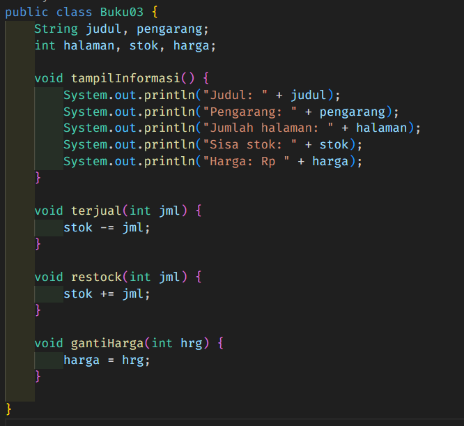

## 2.1.2 Verifikasi Hasil Percobaan

## 2.1.3 Pertanyaan
1. Sebutkan dua karakteristik class atau object!
- Class merupakan objek yang masih berupa struktur/perencanaan.
- Objek merupakan class yang berhasil direalisasikan.

2. Perhatikan class Buku pada Praktikum 1 tersebut, ada berapa atribut yang dimiliki oleh class
Buku? Sebutkan apa saja atributnya!
Class buku memiliki 5 atribut, yaitu :
- judul = String
- pengarang = String
- halaman = int
- stok = int 
- harga = int

3. Ada berapa method yang dimiliki oleh class tersebut? Sebutkan apa saja methodnya!
Ada 4 method yang dimiliki class tersebut, yaitu: 
- void tampilInformasi() 
- void terjual(int jml) 
- void restock(int jml) 
- void gantiHarga(int hrg) 

4. Perhatikan method terjual() yang terdapat di dalam class Buku. Modifikasi isi method tersebut
sehingga proses pengurangan hanya dapat dilakukan jika stok masih ada (lebih besar dari 0)!
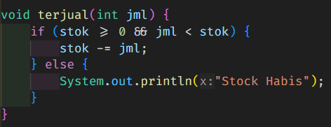

5. Menurut Anda, mengapa method restock() mempunyai satu parameter berupa bilangan int?
Karena hanya terdapat satu parameter yang dibutuhkan untuk method restock() yaitu bilangan int.

## Percobaan 2: Instansiasi Object, serta Mengakses Atribut dan Method
## 2.2.1 Langkah-langkah Percobaan
Kode Program:
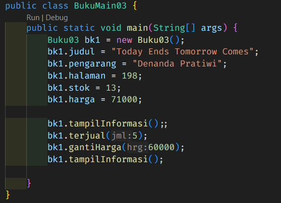

## 2.2.2 Verifikasi Hasil Percobaan
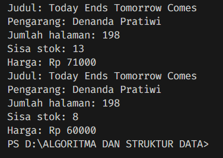

## 2.2.3 Pertanyaan

1. Pada class BukuMain, tunjukkan baris kode program yang digunakan untuk proses instansiasi!
Apa nama object yang dihasilkan?
Berikut adalah baris program yang digunakan untuk proses instansiasi:

    Nama object yang dihasilkan adalah bk1

2. Bagaimana cara mengakses atribut dan method dari suatu objek?
    Cara mengakses atribut yaitu dengan memberikan titik setelah nama objek tanpa spasi.

3. Mengapa hasil output pemanggilan method tampilInformasi() pertama dan kedua berbeda?
Pada method yang pertama, kode program mengikuti data yang berada diatas method tampilInformasi() pertama, sementara pada method yang kedua, kode program membaca data dibawah mathod tampilInformasi() pertama sehingga menghasilkan hasil yang berbeda. 

## 2.3 Percobaan 3: Membuat Konstruktor
## 2.3.1 Langkah-langkah Percobaan

1. Menambahkan dua method di dalam class buku yang terdiri dari datu konstruktor default dan satu konstruktor berparameter.
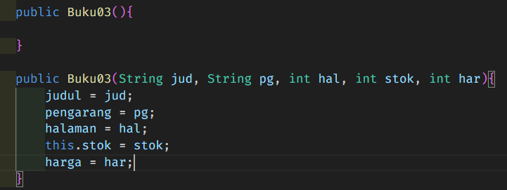

2. Menambahkan object lagi bernama bk2
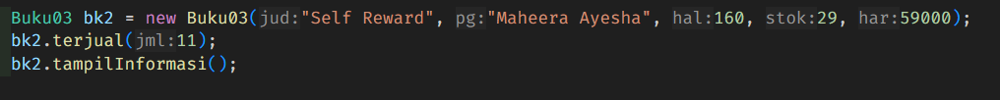

## 2.3.2 Verifikasi Hasil percobaan 
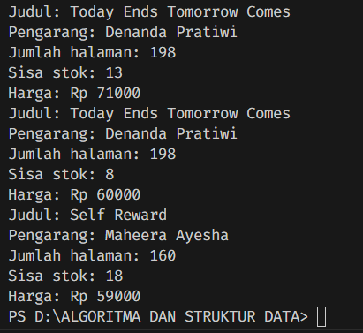

## 2.3.3 2.3.3 Pertanyaan
1. Pada class Buku di Percobaan 3, tunjukkan baris kode program yang digunakan untuk mendeklarasikan konstruktor berparameter!
Berikut adalah kode program yang mendeklarasikan konstruktor berparameter.
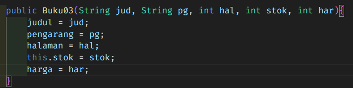

2. Perhatikan class BukuMain. Apa sebenarnya yang dilakukan pada baris program berikut?
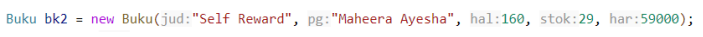

    Baris program tersebut dapat langsung memasukkan value secara otomatis karena terhubung dengan method berparameter. Method berparameter dapat mempersingkat kode progfam sehingga kode lebih efisien.

3. Hapus konstruktor default pada class Buku, kemudian compile dan run program. Bagaimana hasilnya? Jelaskan mengapa hasilnya demikian!
Berikut adalah hasil setelah konstruktor default dihapus pada class Buku03.
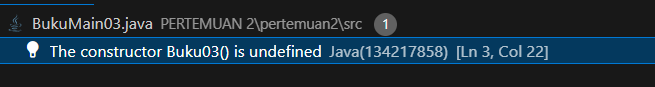
Untuk mengatasi hal tersebut, maka kita harus menambah parameter pada konstruktor yang berada pada BukuMain.

4. Setelah melakukan instansiasi object, apakah method di dalam class Buku harus diakses secara berurutan? Jelaskan alasannya!
Setelah melakukan instansiasi object, maka method dalam class Buku tidak harus dipanggil secara berurutan karena terpanggilnya method tergantung dari method yang kita masukkan terlebih dahulu dalam class BukuMain.

5. Buat object baru dengan nama buku<NamaMahasiswa> menggunakan konstruktor berparameter dari class Buku!
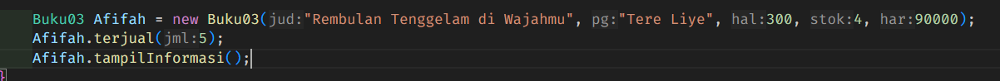

