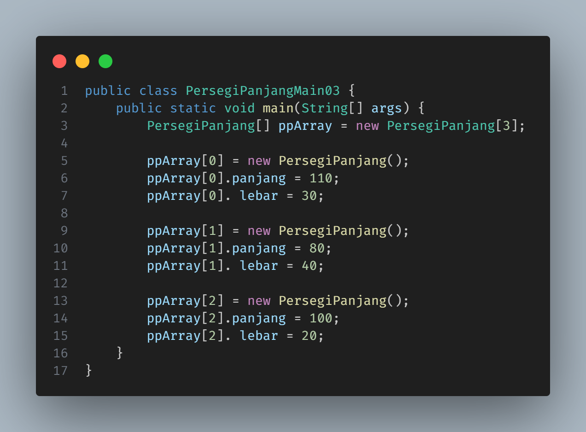
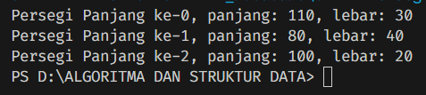
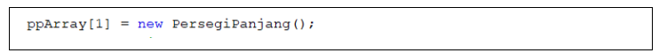
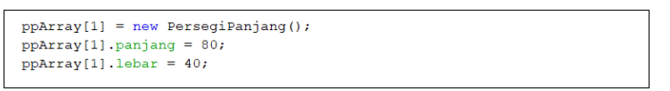

<h1 align="center">LAPORAN ALGORITMA DAN STRUKTUR DATA
PERTEMUAN 1 - KONSEP DASAR PEMROGRAMAN

 

</h1>

<h2>Nama &nbsp;&nbsp;&nbsp;&nbsp;&nbsp;&nbsp;&nbsp;:&nbsp;Afifah Khoirunnisa
 
Kelas &nbsp;&nbsp;&nbsp;&nbsp;&nbsp;&nbsp;&nbsp;&nbsp;:&nbsp;TI-1B
 
NIM&nbsp;&nbsp;&nbsp;&nbsp;&nbsp;&nbsp;&nbsp;&nbsp;&nbsp;&nbsp;:&nbsp;2341720250
 
No.Abs&nbsp;&nbsp;&nbsp;&nbsp;&nbsp;:&nbsp;03</h2>

## 3.2 Percobaan 1: Membuat Array dari Object, Mengisi dan Menampilkan
## 3.2.1 Langkah-langkah Percobaan
### Kode Program

## 3.2.2 Verifikasi Hasil Percobaan
### Output

## 3.2.3 Pertanyaan
### &nbsp;&nbsp;1. Berdasarkan uji coba 3.2, apakah class yang akan dibuat array of object harus selalu memiliki atribut dan sekaligus method Jelaskan!
### Jawaban
Berdasarkan uji coba 3.2, dapat diketahui jika class tidak harus memiliki atribut dan juga method. Pada class PersegiPanjang, hanya terdapat atribut tanpa adanya method, namun kode program tetap dapat dijalankan.

### &nbsp;&nbsp; 2. Apakah class PersegiPanjang memiliki konstruktor?Jika tidak,kenapa dilakukan pemanggilan konstruktur pada baris program berikut :

### Jawaban
Class persegi panjang tidak memiliki konstruktor. Namun, pada class main dilakukan pemanggilan karena menginisiasi objek untuk indeks array tertentu. Hal tersebut merupakan salah satu konsep dari Array of object, jika tidak dilakukan inisiasi objek, maka akan terjadi error NullPointerException. 

## &nbsp;&nbsp; 3. Apa yang dimaksud dengan kode berikut ini:

### Jawaban
Baris tersebut merupakan bagian dari kode yang berisi inisialisasi objek dari class PersegiPanjang, dengan nama objek ppArray. Objek tersebut merupakan bagian dari Array of Object dimana terdapat panjang array berjumlah 3 pada class Persegi Panjang. 

## &nbsp;&nbsp;4. Apa yang dimaksud dengan kode berikut ini:

### Jawaban
Kode tersebut merupakan salah satu cara yang dilakukan untuk memasukkan value pada attribut panjang dan lebar, untuk objek bernama ppArray[] pada indeks ke-1. Baris pertama merupakan inisialisasi objek ppArray[i]. Untuk baris kedua dan ketiga merupakan kode yang dimasukkan untuk memasukkan value panjang dan lebar.

## &nbsp;&nbsp; 5. Mengapa class main dan juga class PersegiPanjang dipisahkan pada uji coba 3.2?
### Jawaban
Class main dan class PersegiPanjang dipisah karena pembuatan class yang berbeda akan mempersingkat kode program. Kita dapat dengan mudah memanggil attributnya saat digunakan kembali dengan mudah. 

