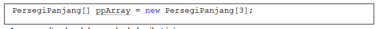
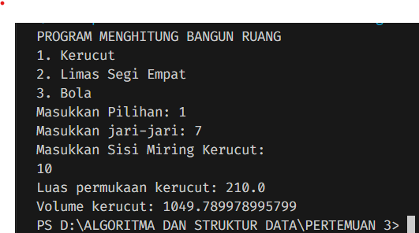

<h1 align="center">LAPORAN ALGORITMA DAN STRUKTUR DATA
PERTEMUAN 3 - ARRAY OF OBJECT

 

</h1>

<h2>Nama &nbsp;&nbsp;&nbsp;&nbsp;&nbsp;&nbsp;&nbsp;:&nbsp;Afifah Khoirunnisa
 
Kelas &nbsp;&nbsp;&nbsp;&nbsp;&nbsp;&nbsp;&nbsp;&nbsp;:&nbsp;TI-1B
 
NIM&nbsp;&nbsp;&nbsp;&nbsp;&nbsp;&nbsp;&nbsp;&nbsp;&nbsp;&nbsp;:&nbsp;2341720250
 
No.Abs&nbsp;&nbsp;&nbsp;&nbsp;&nbsp;:&nbsp;03</h2>

## 3.2 Percobaan 1: Membuat Array dari Object, Mengisi dan Menampilkan
## 3.2.1 Langkah-langkah Percobaan
### Kode Program

## 3.2.2 Verifikasi Hasil Percobaan
### Output

## 3.2.3 Pertanyaan
### &nbsp;&nbsp;1. Berdasarkan uji coba 3.2, apakah class yang akan dibuat array of object harus selalu memiliki atribut dan sekaligus method Jelaskan!
### Jawaban
Berdasarkan uji coba 3.2, dapat diketahui jika class tidak harus memiliki atribut dan juga method. Pada class PersegiPanjang, hanya terdapat atribut tanpa adanya method, namun kode program tetap dapat dijalankan.

### &nbsp;&nbsp; 2. Apakah class PersegiPanjang memiliki konstruktor?Jika tidak,kenapa dilakukan pemanggilan konstruktur pada baris program berikut :

### Jawaban
Class persegi panjang tidak memiliki konstruktor. Namun, pada class main dilakukan pemanggilan karena menginisiasi objek untuk indeks array tertentu. Hal tersebut merupakan salah satu konsep dari Array of object, jika tidak dilakukan inisiasi objek, maka akan terjadi error NullPointerException. 

## &nbsp;&nbsp; 3. Apa yang dimaksud dengan kode berikut ini:

### Jawaban
Baris tersebut merupakan bagian dari kode yang berisi inisialisasi objek dari class PersegiPanjang, dengan nama objek ppArray. Objek tersebut merupakan bagian dari Array of Object dimana terdapat panjang array berjumlah 3 pada class Persegi Panjang. 

## &nbsp;&nbsp;4. Apa yang dimaksud dengan kode berikut ini:

### Jawaban
Kode tersebut merupakan salah satu cara yang dilakukan untuk memasukkan value pada attribut panjang dan lebar, untuk objek bernama ppArray[] pada indeks ke-1. Baris pertama merupakan inisialisasi objek ppArray[i]. Untuk baris kedua dan ketiga merupakan kode yang dimasukkan untuk memasukkan value panjang dan lebar.

## &nbsp;&nbsp; 5. Mengapa class main dan juga class PersegiPanjang dipisahkan pada uji coba 3.2?
### Jawaban
Class main dan class PersegiPanjang dipisah karena pembuatan class yang berbeda akan mempersingkat kode program. Kita dapat dengan mudah memanggil attributnya saat digunakan kembali dengan mudah. 

## 3.3 Percobaan 2: Menerima Input Isian Array Menggunakan Looping
## 3.3.1 Langkah-langkah Percobaan
### Kode Program

## 3.3.2 Verifikasi Hasil Percobaan

## 3.3.3 Pertanyaan
## &nbsp;&nbsp;1. Apakah array of object dapat diimplementasikan pada array 2 Dimensi?
### Jawaban
Ya, Array of object dapat diimplementasikan pada array 2 dimensi. Implementasi array of object 2 dimensi adalah dengan membuat array yang memiliki elemen array. Setiap elemen array utama akan menjadi array yang berisi objek-objek dari kelas yang sama. Inisialisasi objek pada array 2 dimensi sama seperti menginisiasi objek pada array biasa.

## &nbsp;&nbsp; 2. Jika jawaban soal no satu iya, berikan contohnya! Jika tidak, jelaskan!
### Jawaban
Contohnya, saya memiliki class bernama animal. Pada class main, saya menginstansiasi nama objek untuk Array 2 dimensi pada array of objek, bernama:
### Animal[][] zoo = new Animal [2][3];
Kode diatas merupakan inisialisasi objek bernama zoo, dengan panjang baris yaitu 2 dan panjang kolom yaitu 3. Lalu, untuk memasukkan valuenya, bisa menggunakan kode berikut. 

### zoo[0][0] = new Animal("Lion");
### zoo[0][1] = new Animal("Tiger");
### zoo[0][2] = new Animal("Leopard");
### zoo[1][0] = new Animal("Elephant");
### zoo[1][1] = new Animal("Giraffe");
### zoo[1][2] = new Animal("Zebra");
    
Atau juga bisa memasukkan value untuk kode dengan menggunakan looping.

## &nbsp;&nbsp; 3. Jika diketahui terdapat class Persegi yang memiliki atribut sisi bertipe integer, maka kode dibawah ini akan memunculkan error saat dijalankan. Mengapa?

### Jawaban
Kode tersebut error karena belum dituliskan instansiasi objek untuk pgArray indeks ke-5. Seharusnya, setelah instansiasi objek bernama pgArray, maka melakukan instansiasi pgArray indeks ke 5, seperti berikut.
### pdArray[5] = new Persegi();

### &nbsp;&nbsp; 4. Modifikasi kode program pada praktikum 3.3 agar length array menjadi inputan dengan Scanner!
### Jawaban

### &nbsp;&nbsp;5. Apakah boleh Jika terjadi duplikasi instansiasi array of objek, misalkan saja instansiasi dilakukan pada ppArray[i] sekaligus ppArray[0]?Jelaskan !
### Jawaban

Secara kode program seharusnya tidak akan terjadi error. Duplikasi instansiasi yang dilakukan saat looping dan dilakukan di luar loop masih bisa dilakukan. Namun, untuk hal efektivitas kode, hal hal tersebut tidak dibenarkan. Kode yang di duplikasi akan sulit menghabiskan memori jika terus menerus dilakukan dalam jumlah besar.

## 3.4 Percobaan 3: Penambahan Operasi Matematika di Dalam Method
## 3.4.1 Langkah-langkah Percobaan
## kode Program

## 3.4.2 Verifikasi Hasil Percobaan

## 3.4.3 Pertanyaan
### &nbsp;&nbsp;1. Dapatkah konstruktor berjumlah lebih dalam satu kelas? Jelaskan dengan contoh!
### Jawaban 
Dalam satu kelas, konstruktor boleh berjumlah lebih dari satu. Dengan syarat, satu konstruktor memiliki parameter, dan konstruktor yang lain tidak memiliki parameter. Contohnya: Saya memiliki class bernama persegi. Lalu, saya masukkan  konstruktor persegi tanpa parameter. Kemudian, saya masukkan konstruktor dengan parameter. Kedua konstruktor tersebut dapat dijalankan tanpa menyebabkan error.

### &nbsp;&nbsp;2. Jika diketahui terdapat class Segitiga seperti berikut ini:

### &nbsp;&nbsp;Tambahkan konstruktor pada class Segitiga tersebut yang berisi parameter int a, int t yang masing-masing digunakan untuk mengisikan atribut alas dan tinggi.
### Jawaban 

### &nbsp;&nbsp;3. Tambahkan method hitungLuas() dan hitungKeliling() pada class Segitigatersebut. Asumsi segitiga adalah segitiga siku-siku. (Hint: Anda dapat menggunakan bantuanlibrary Math pada Java untuk mengkalkulasi sisi miring)
### Jawaban 

### &nbsp;&nbsp;4. Pada fungsi main, buat array Segitiga sgArray yang berisi 4 elemen, isikan masing-masing atributnya sebagai berikut:
### - sgArray ke-0 alas: 10, tinggi: 4
### - sgArray ke-1 alas: 20, tinggi: 10
### - sgArray ke-2 alas: 15, tinggi: 6
### - sgArray ke-3 alas: 25, tinggi: 10
### Jawaban

### &nbsp;&nbsp;5. Kemudian menggunakan looping, cetak luas dan keliling dengan cara memanggil method hitungLuas() dan hitungKeliling().
## Jawaban

## LATIHAN PRAKTIKUM
## PERTANYAAN 1: 

## KODE PROGRAM MAIN

## KODE PROGRAM KERUCUT

## KODE PROGRAM LIMAS SEGI EMPAT

## KODE PROGRAM BOLA

## OUTPUT PROGRAM

## PERTANYAAN 2:

## KODE PROGRAM MAIN

## KODE PROGRAM

## OUTPUT

