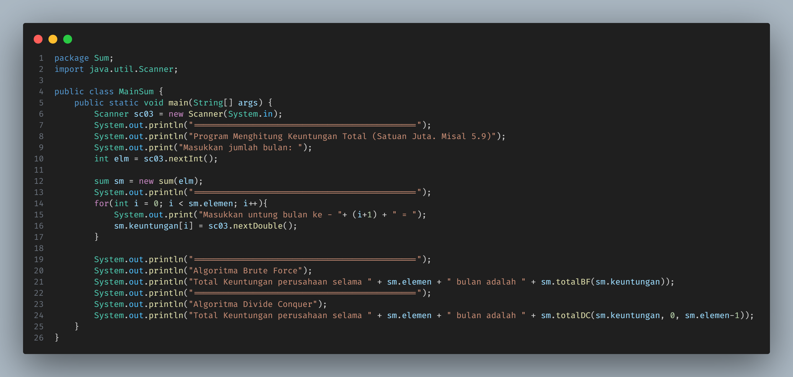
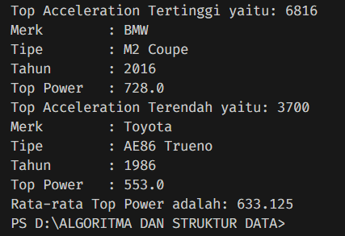

<h1 align="center">LAPORAN ALGORITMA DAN STRUKTUR DATA
PERTEMUAN 1 - KONSEP DASAR PEMROGRAMAN

 

</h1>

<h2>Nama &nbsp;&nbsp;&nbsp;&nbsp;&nbsp;&nbsp;&nbsp;:&nbsp;Afifah Khoirunnisa
 
Kelas &nbsp;&nbsp;&nbsp;&nbsp;&nbsp;&nbsp;&nbsp;&nbsp;:&nbsp;TI-1B
 
NIM&nbsp;&nbsp;&nbsp;&nbsp;&nbsp;&nbsp;&nbsp;&nbsp;&nbsp;&nbsp;:&nbsp;2341720250
 
No.Abs&nbsp;&nbsp;&nbsp;&nbsp;&nbsp;:&nbsp;03</h2>

## 4.2 Menghitung Nilai Faktorial dengan Algoritma Brute Force dan Divide and Conquer
## 4.2.1 Langkah-langkah Percobaan
## KODE PROGRAM

## 4.2.2 Verifikasi Hasil Percobaan

## 4.2.3 Pertanyaan
## 1. Pada base line Algoritma Divide Conquer untuk melakukan pencarian nilai faktorial, jelaskan perbedaan bagian kode pada penggunaan if dan else!
## Jawaban: 
### &nbsp;&nbsp;- Pada kode tersebut, apabila nilai n = 1, maka output akan menjalankan pemilihan "if" sehingga menghasilkan return 1,
### &nbsp;&nbsp;- Apabila nilai n tidak sama dengan 1, maka kode akan menjalankan pemilihan "else" untuk menghitung faktorial dari nilai n hingga 1

## 2. Apakah memungkinkan perulangan pada method faktorialBF() dirubah selain menggunakan for?Buktikan!
## Jawaban:
## &nbsp;&nbsp;Kode tersebut dapat berjalan selain menggunakan for, yaitu dengan menggunakan do dan do while.

## 3. Jelaskan perbedaan antara fakto *= i; dan int fakto = n * faktorialDC(n-1); !
## Jawaban:
### &nbsp;&nbsp;- fakto *= i berarti eksekusi perkalian dimulai dari 1 hingga ke n.
### &nbsp;&nbsp;- int fakto = n * faktorialDC(n-1) berarti eksekusi perkalian dimulai dari n hingga ke 1.

## 4.3 Menghitung Hasil Pangkat dengan Algoritma Brute Force dan Divide and Conquer
## 4.3.1 Langkah-langkah Percobaan
## KODE PROGRAM

## 4.3.2 Verifikasi Hasil Percobaan

## 4.3.3 Pertanyaan
### &nbsp;&nbsp;1. Jelaskan mengenai perbedaan 2 method yang dibuat yaitu PangkatBF() dan PangkatDC()!
### Jawaban:
### &nbsp;&nbsp; - PangkatBF() menggunakan metode mengurutkan sehingga input yang masuk diurutkan sehingga mencapai hasil perpangkatan dari nilai dan elemen.
### &nbsp;&nbsp; - PangkatDC() menggunakan metode membagi suatu kelompok bilangan. Dalam kode tersebut, jika nilai n == 0, maka return nya sama dengan 1. Jika kita tarik pada metode perpangkatan, hal tersebut benar dikarenakan bilangan apapun yang dipangkatkan dengan 0, maka hasilnya adalah 1. Jika nilai hasil bagi n dengan 2 masih bersisa 1, maka akan terjadi 2 kemungkinan:
    1. Kemungkinan pertama, nilai return merupakan nilai dari pangkatDC (a,n/2)*pangkatDC(a,n/2)*a
        - Kondisi ini terjadi jika nilai merupakan nilai ganjil
    2. Kemungkinan Kedua, nilai return merupakan nilai dari pangkatDC (a,n/2)*pangkatDC(a,n/2)
        - Kondisi ini terjadi jika nilai merupakan nilai genap

### &nbsp;&nbsp; 2. Apakah tahap combine sudah termasuk dalam kode tersebut?Tunjukkan!
### Jawaban: 
### &nbsp;&nbsp; Tahap combine sudah termasuk dalam kode tersebut, tepatnya pada bagian else if

### &nbsp;&nbsp; Pada kode tersebut, jika kedua nilaisudah dipisah dan menemukan hasil akhir, maka akan gambungkan antara hasil sisi yang ganjil dan sisi yang genap. 

### &nbsp;&nbsp; 3. Modifikasi kode program tersebut, anggap proses pengisian atribut dilakukan dengan konstruktor.
## Jawaban:

### &nbsp;&nbsp;4. Tambahkan menu agar salah satu method yang terpilih saja yang akan dijalankan menggunakan switch-case!
### Jawaban:

## 4.4 Menghitung Sum Array dengan Algoritma Brute Force dan Divide and Conquer
## 4.4.1 Langkah-langkah Percobaan
## Kode Program

## 4.4.2 Verifikasi Hasil Percobaan

## 4.4.3 Pertanyaan
### &nbsp;&nbsp;1. Mengapa terdapat formulasi return value berikut?Jelaskan!
### &nbsp;&nbsp;return = lsum + rsum + arr[mid];
### Jawaban: 
### &nbsp;&nbsp;Return tersebut berfungsi untuk menambahkan nilai dari bagian kanan, bagian kiri, dan bagian tengah dari array. Return tersebut merupakan hasil dari semua nilai yang diinputkan

### &nbsp;&nbsp;2. Kenapa dibutuhkan variable mid pada method TotalDC()?
### Jawaban:
### &nbsp;&nbsp; Variable mid pada method TotalDC() dibutuhkan apabila array memiliki indeks ganjil. 

### &nbsp;&nbsp;3. Program perhitungan keuntungan suatu perusahaan ini hanya untuk satu perusahaan saja. Bagaimana cara menghitung sekaligus keuntungan beberapa bulan untuk beberapa perusahaan.(Setiap perusahaan bisa saja memiliki jumlah bulan berbeda-beda)? Buktikan dengan program

### Jawaban
### KODE PROGRAM

### OUTPUT

## 4.5 LATIHAN PRAKTIKUM

## KODE PROGRAM 

## OUTPUT

