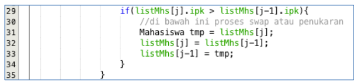

<h1 align="center">LAPORAN ALGORITMA DAN STRUKTUR DATA
PERTEMUAN  6 - BUBBLE SORT, SELECTION SORT, INSERTION SORT

 

</h1>

<h2>Nama &nbsp;&nbsp;&nbsp;&nbsp;&nbsp;&nbsp;&nbsp;:&nbsp;Afifah Khoirunnisa
 
Kelas &nbsp;&nbsp;&nbsp;&nbsp;&nbsp;&nbsp;&nbsp;&nbsp;:&nbsp;TI-1B
 
NIM&nbsp;&nbsp;&nbsp;&nbsp;&nbsp;&nbsp;&nbsp;&nbsp;&nbsp;&nbsp;:&nbsp;2341720250
 
No.Abs&nbsp;&nbsp;&nbsp;&nbsp;&nbsp;:&nbsp;03</h2>

## 5.2 MENGURUTKAN DATA MAHASISWA BERDASARKAN IPK DENGAN MENGGUNAKAN BUBBLE SORT
## 5.2.1 LANGKAH-LANGKAH PERCOBAAN

## 5.2.2 VERIFIKASI HASIL PERCOBAAN

## 5.2.3 PERTANYAAN

### 1. Terdapat di method apakah proses bubble sort?
### Jawaban
    Proses Bubble Sort terdapat dalam method bubbleSort().
### 2. Di dalam method bubbleSort(), terdapat baris program seperti di bawah ini:

### Untuk apakah proses tersebut?
### Jawaban
    Method tersebut berfungsi untuk mengurutkan nilai IPK mahasiswa dari IPK terbesar ke terkecil.
### 3. Perhatikan perulangan di dalam bubbleSort() di bawah ini:

### a. Apakah perbedaan antara kegunaan perulangan i dan perulangan j?
### Jawaban
    Perulangan i = digunakan untuk         mengontrol jumlah pengulangan di seluruh array. Setiap iterasi 'i' menandakan bahwa elemen terakhir array sudah berada di posisi yang benar setelah iterasi sebelumnya. Pada setiap iterasi, elemen terbesar akan berada pada ujung array.
    - Pengulangan j = digunakan untuk membandingkan elemen-elemen yang bedekatan. Jika elemen j lebih besar dari elemen pada indeks j-1, maka kedua elemen tersebut akan ditukar.

### b. Mengapa syarat dari perulangan i adalah i<listMhs.length-1 ?
### Jawaban
    Karena perulangan i dimulai dari indeks nol array hingga jumlah indeks dikurangi satu. Itu artinya, perulangan akan terus terjadi dalam jumlah indeks - 1 untuk menandai bahwa array sudah berada pada posisi yang benar setelah iterasi sebelumnya.

### c. Mengapa syarat dari perulangan j adalah j<listMhs.length-i ?
### Jawaban
    Karena dalam setiap iterasi i, iterasi j membandingkan elemen pada indeks j dan j-1, jika elemen j lebih besar dari j-1, maka elemen tersebut akan ditukar. Iterasi akan diulangi untuk setiap elemn dalam array. 

### d. Jika banyak data di dalam listMhs adalah 50, maka berapakali perulangan i akan berlangsung? Dan ada berapa Tahap bubble sort yang ditempuh?
### Jawaban
    Jika banyak data di dalam listMhs adalah 50, maka perulangan i akan berlangsung sebanyak 49 kali. Pada iterasi terakhir (ke-50), tidak ada lagi perbandingan yang perlu dilakukan karena elemen sudah terurut. Perulangan i dimulai dari 0 dan berhenti sebelum mencapai ListMhs.length - 1 (50 - 1 = 49).

## 5.3 Mengurutkan Data Mahasiswa Berdasarkan IPK Menggunakan Selection Sort
## 5.3.1. Langkah-langkah Percobaan

## 5.3.2. Verifikasi Hasil Percobaan

## 5.3.3. Pertanyaan
### Di dalam method selection sort, terdapat baris program seperti di bawah ini:

### Untuk apakah proses tersebut, jelaskan!
### Jawaban:
    Loop pertama (for(int i=0; i<ListMhs.length - 1; i++)) digunakan untuk mengiterasi melalui array ListMhs dari indeks ke-0 hingga indeks sebelum terakhir. Setiap iterasi i menunjukkan bahwa elemen pada indeks i adalah elemen yang akan ditempatkan di posisi yang tepat dalam array yang sudah diurutkan. 

## 5.4 Mengurutkan Data Mahasiswa Berdasarkan IPK Menggunakan Insertion Sort
## 5.4.1 Langkah-langkah Percobaan

## 5.4.2 Verifikasi Hasil Percobaan

## 5.4.3 Pertanyaan
### Ubahlah fungsi pada InsertionSort sehingga fungsi ini dapat melaksanakan proses sorting dengan cara descending.
### Jawaban

## 5.4 Latihan praktikum

## Kode Program 
### Class Main

### Class Hotel

### Class HotelService

## Output
### 1. Harga Terendah Hingga Tertinggi

### 2. Rating Tertinggi Hingga Terendah

