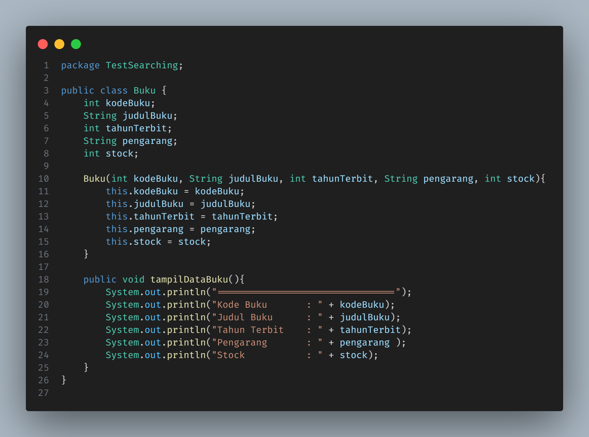
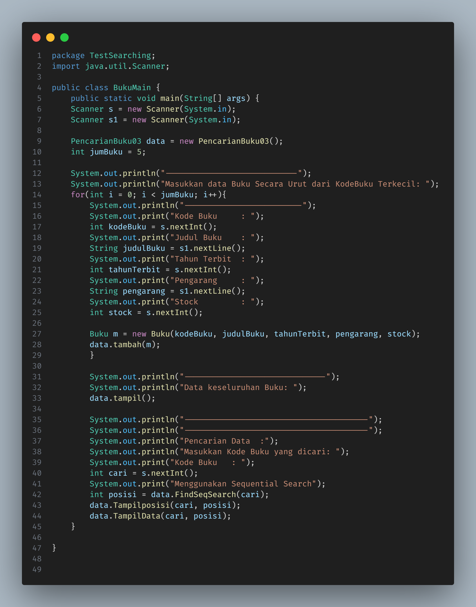

<h1 align="center">LAPORAN ALGORITMA DAN STRUKTUR DATA
PERTEMUAN  7 - SEARCHING

 

</h1>

<h2>Nama &nbsp;&nbsp;&nbsp;&nbsp;&nbsp;&nbsp;&nbsp;:&nbsp;Afifah Khoirunnisa
 
Kelas &nbsp;&nbsp;&nbsp;&nbsp;&nbsp;&nbsp;&nbsp;&nbsp;:&nbsp;TI-1B
 
NIM&nbsp;&nbsp;&nbsp;&nbsp;&nbsp;&nbsp;&nbsp;&nbsp;&nbsp;&nbsp;:&nbsp;2341720250
 
No.Abs&nbsp;&nbsp;&nbsp;&nbsp;&nbsp;:&nbsp;03</h2>

## Searching / Pencarian Menggunakan Algoritma Sequential Search
## 6.2.1 Langkah-langkah Percobaan Sequential Search

## 6.2.2 Verifikasi Hasil Percobaan

## 6.2.3 Pertanyaan

### 1. Jelaskan fungsi break yang ada pada method FindSeqSearch!
### Jawaban:
    Break pada method FIndSeqSearch berfungsi untuk menghentikan loop ketika berhasil menemukan kode buku yang dicari.

### 2. Jika Data Kode Buku yang dimasukkan tidak terurut dari kecil ke besar. Apakah program masih dapat berjalan? Apakah hasil yang dikeluarkan benar? Tunjukkan hasil screenshoot untuk bukti dengan kode Buku yang acak. Jelaskan Mengapa hal tersebut bisa terjadi?
### Jawaban:

    Data yang saya berikan acak, dan program tetap dapat berjalan, hal tersebut dikarenakan dalam metode pencarian secara sequential, data tidak harus urut untuk dapat dilakukan suatu pencarian. Maka dari itu, data yang berada dalam kondisi acak tetap dapat ditemukan jika dicari.

### 3. Buat method baru dengan nama FindBuku menggunakan konsep sequential search dengan tipe method dari FindBuku adalah BukuNoAbsen. Sehingga Anda bisa memanggil method tersebut pada class BukuMain seperti gambar berikut :

### Jawaban: 
### Kode Program

### Output

## 6.3 Searching / Pencarian Menggunakan Binary Search
## 6.3.1 Langkah-langkah Percobaan Binary Search

## 6.3.2 Verifikasi Hasil Percobaan

## 6.3.3 Pertanyaan
### 1. Tunjukkan pada kode program yang mana proses divide dijalankan!
### Jawaban: 

### 2. Tunjukkan pada kode program yang mana proses conquer dijalankan!
### Jawaban: 

### 3. Jika data Kode Buku yang dimasukkan tidak urut. Apakah program masih dapat berjalan? Mengapa demikian! Tunjukkan hasil screenshoot untuk bukti dengan kode Buku yang acak. Jelaskan mengapa hal tersebut bisa terjadi?
### Jawaban: 

    Kode yang ditemukan benar. Jika binary search berhasil menemukan kode buku dalam array yang tidak terurut, ini kemungkinan besar karena kebetulan atau kondisi tertentu pada dataset yang digunakan. Meskipun hasilnya mungkin tampak konsisten dalam beberapa percobaan, ini tidak menjamin bahwa binary search akan bekerja secara konsisten dalam semua situasi di mana data tidak terurut. 

### 4. Jika Kode Buku yang dimasukkan dari Kode Buku terbesar ke terkecil (missal : 20215, 20214, 20212, 20211, 20210) dan elemen yang dicari adalah 20210. Bagaimana hasil dari binary search? Apakah sesuai? Jika tidak sesuai maka ubahlah kode program binary seach agar hasilnya sesuai!
### Jawaban: 
    Hasilnya tidak sesuai dan menimbulkan infinite loop. Maka dari itu, saya menambah sorting dengan menggunakan bubble sort untuk mengurutkan data nya terlebih dahulu, baru kemudian dilakukan binary search.

#### Kode Program

#### Output

## 6.4 Percobaan Pengayaan Divide and Conquer
## 6.4.1 Langkah-langkah Percobaan Merge Sort

## 6.4.2 Verifikasi Hasil Percobaan

## 6.5 Latihan Praktikum
### 1. Modifikasi percobaan searching diatas dengan ketentuan berikut ini
### - Ubah tipe data dari kode Buku yang awalnya int menjadi String
### - Tambahkan method untuk pencarian kode Buku (bertipe data String) dengan menggunakan sequential search dan binary search.

### 2. Modifikasi percobaan searching diatas dengan ketentuan berikut ini
### - Tambahkan method pencarian judul buku menggunakan sequential search dan binary
search. Sebelum dilakukan searching dengan binary search data harus dilakukan pengurutan
dengan menggunakan algoritma Sorting (bebas pilih algoritma sorting apapun)! Sehingga
ketika input data acak, maka algoritma searching akan tetap berjalan
### - Buat aturan untuk mendeteksi hasil pencarian judul buku yang lebih dari 1 hasil dalambentuk kalimat peringatan! Pastikan algoritma yang diterapkan sesuai dengan kasus yang diberikan!

